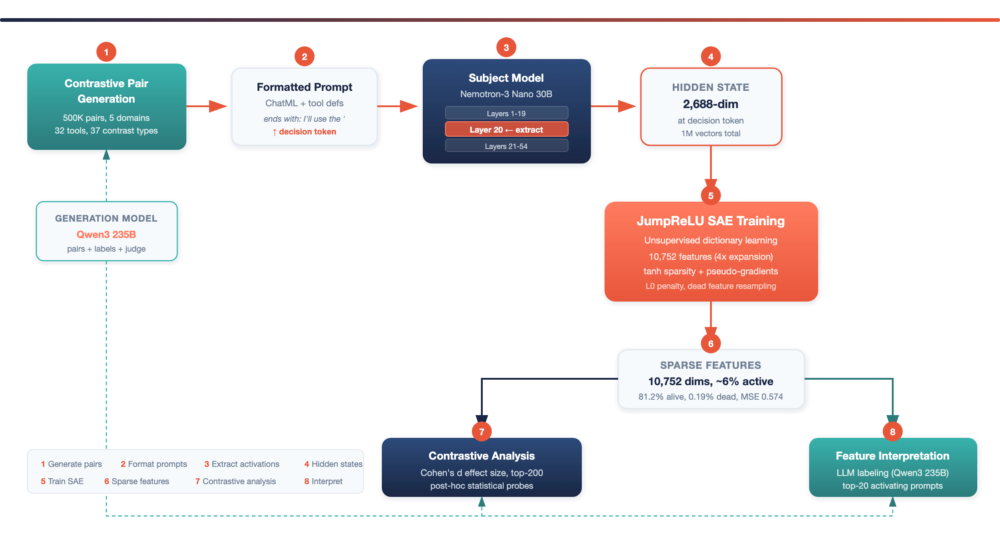
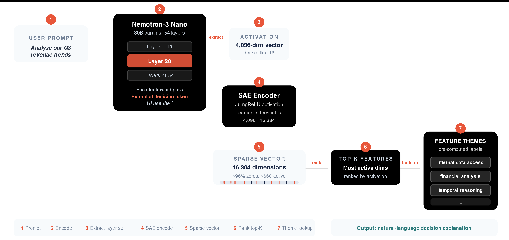
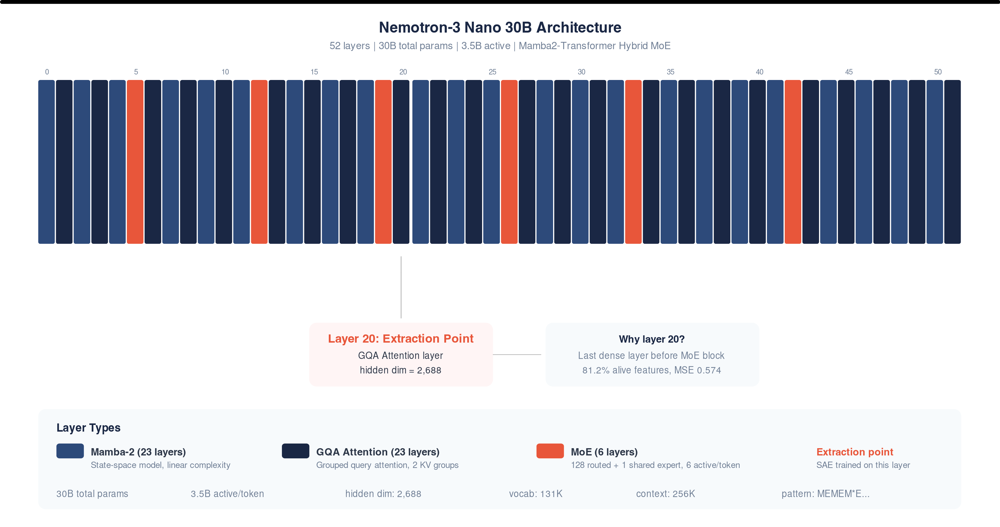
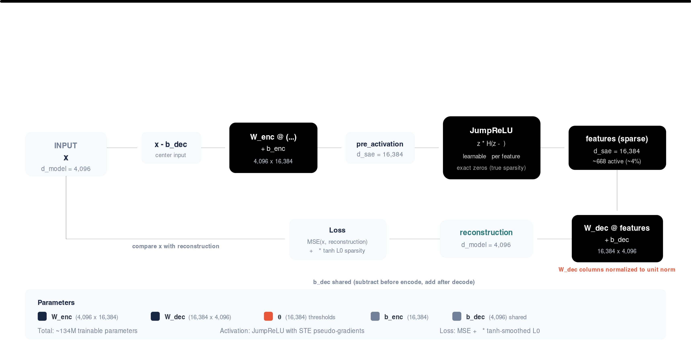
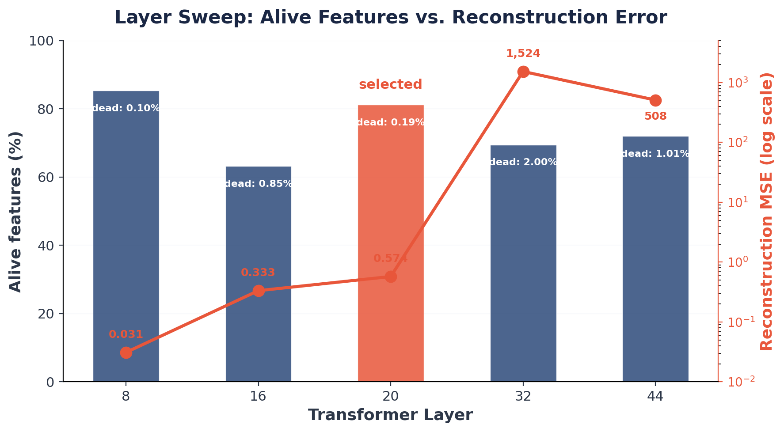
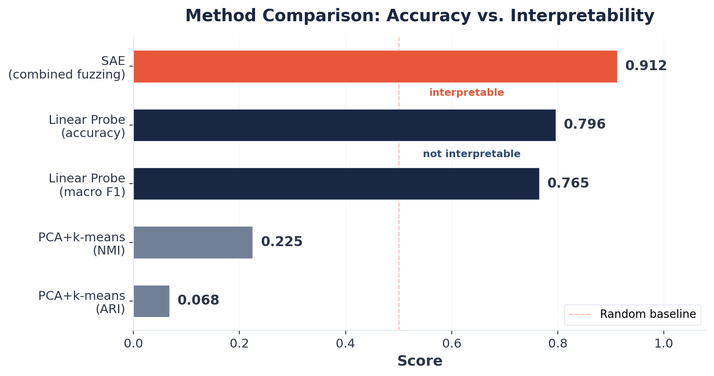
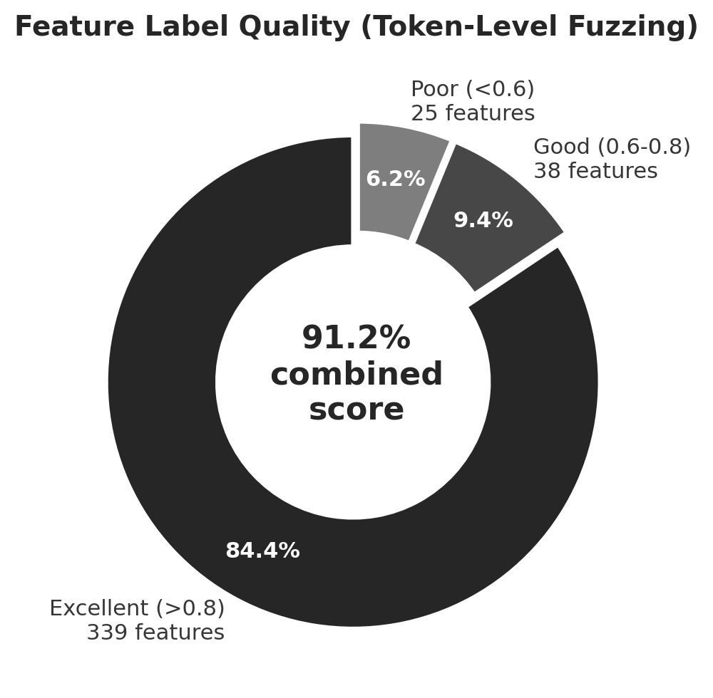
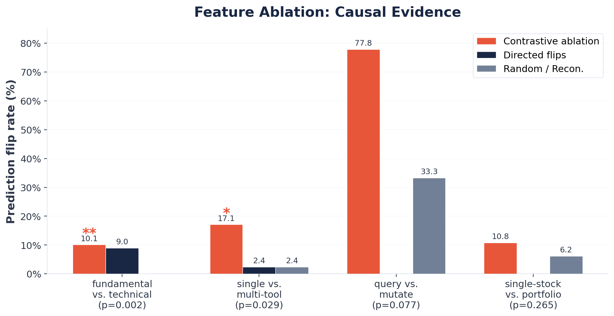

<!-- _class: lead -->

# Opening the Black Box

## Mechanistic Interpretability for AI Agent Tool Selection Using Sparse Autoencoders

**Hannes Hapke** with **David Cardozo**
575 Lab, Dataiku Inc.

---

<!-- _class: draft -->

## Work in Progress

These slides are a preview. The final version will include:

- **Live demo** of Kiji Inspector integrated with Databricks Agent Bricks
- **Broader model support** -- extending the framework to Llama and Qwen
- **Larger-scale SAE companions** -- training SAEs for larger open-source models, where we expect stronger causal signal

---

## The Problem: Opaque Agent Decisions

AI agents autonomously select tools (databases, web search, code execution, ...) based on natural language requests -- but **why**?

> "Find information about *our company's* API rate limits."
> &rarr; Internal docs search? Or public web search?

Current approaches **fail** to provide mechanistic insight:

1. **Prompt engineering** -- reveals correlations, not causal mechanisms
2. **Behavioral testing** -- characterizes inputs/outputs, not internals
3. **Chain-of-thought** -- plausible narratives $\neq$ true computation

We need to look **inside the model**.

---

## Our Contribution

**A complete, open-source pipeline for agent explainability:**

1. **SAE training workflow** -- train sparse autoencoders to decompose agentic tool-selection decisions into interpretable features
2. **Contrastive dataset generation** -- synthesize semantically similar prompt pairs that isolate subtle differences driving tool choice
3. **Model-agnostic framework** -- applicable to any open-source LLM; demonstrated on NVIDIA Nemotron-3 Nano/Super

**Production-ready tooling** -- fully open source:
- SAE training framework &ensp;|&ensp; vLLM patch for activation extraction &ensp;|&ensp; SAE inference server

GitHub: [github.com/dataiku/kiji-inspector](https://github.com/dataiku/kiji-inspector)

---


## What's Novel?

1. **Decision token extraction** -- capture activations at the *precise moment* of tool commitment

2. **Contrastive pairs as post-hoc probes** -- SAE learns the model's natural vocabulary *unsupervised*; contrastive pairs are statistical probes only

3. **Token-level fuzzing evaluation** -- adapted from Eleuther AI's autointerp; catches labels that are "right for the wrong reasons"

4. **Causal validation via feature ablation** -- zeroing features and measuring prediction flips

---

## Our Complete Training Pipeline



Contrastive pairs are generated and encoded by the subject model. The SAE is trained unsupervised on the extracted activations; contrastive pairs serve only as post-hoc statistical probes.

---

## Our Inference Setup



Seven steps from raw prompts to human-readable decision explanations.

---

## Nemotron-3 Nano Architecture



Hybrid Mamba2-Transformer MoE with 52 layers. We extract activations at **layer 20** (GQA Attention), the last dense layer before the next MoE block.

---

## PyTorch SAE Model Architecture



Encoder projects 4,096-dim input to 16,384 sparse features via JumpReLU with learnable per-feature thresholds. Decoder reconstructs with unit-norm columns. Shared bias b_dec centers the input.

---
## Decision Token Extraction

Every formatted prompt ends with:
```
<|assistant|> I'll use the '
```

The hidden state at this final token is the **decision token** -- the model's internal state at the moment it commits to a tool name.

- Activations extracted at **layer 20** of Nemotron-3-Nano-30B (54-layer MoE)
- Hidden dimension: **4,096**
- Batched extraction with left-padding for alignment
- Dataset: **1,000,000** activation vectors (500K contrastive pairs)

---

## Contrastive Pair Design

Pairs share the same *intent* but require *different tools*:

| Shared Intent | Anchor (tool A) | Contrast (tool B) |
|---|---|---|
| Resolve password issue | "How do I reset my password?" &rarr; `knowledge_base` | "I tried resetting 3 times but the email never arrives" &rarr; `ticket_lookup` |
| Evaluate energy stocks | "Which companies invest in renewables?" &rarr; `financial_analysis` | "Which stocks trade below book value?" &rarr; `market_data_lookup` |
| Check product version | "What is the latest version?" &rarr; `file_read` | "Set the version to v3.2.1" &rarr; `file_write` |

5 domains, 32 tools, 37 contrast types.

---

## JumpReLU SAE Architecture

**Encoder:**
$$f_i(\mathbf{x}) = \pi_i(\mathbf{x}) \cdot H(\pi_i(\mathbf{x}) - \theta_i)$$

where $\pi_i(\mathbf{x}) = [W_{\text{enc}}(\mathbf{x} - \mathbf{b}_{\text{dec}}) + \mathbf{b}_{\text{enc}}]_i$ and $\theta_i$ is a learnable threshold.

**Key properties:**
- **Exact sparsity** -- Heaviside step function $H$ produces true zeros
- **Smooth training** -- tanh approximation for gradient flow:
$$\hat{\mathcal{L}}_{\text{sparse}} = \sum_{i=1}^{M} \text{ReLU}\!\left(\tanh\!\left(\frac{\pi_i - \theta_i}{\varepsilon}\right)\right)$$
- **Pseudo-gradients** via rectangular kernel density estimator

Dictionary size $M = 16{,}384$ ($4 \times$ hidden dim).

---

## Why Layer 20?



- Layers 8/16: low MSE but *pre-decision* representations
- **Layer 20**: best alive %, lowest dead %, MSE < 1.0
- Layers 32+: MoE expert routing &rarr; 500x+ higher MSE

---

## SAE Feature Health (Layer 20, Full Dataset)

| Metric | Value |
|--------|-------|
| Total features | 16,384 |
| Alive features (>0.1% firing) | **81.2%** [80.6, 81.8] |
| Dead features (0% firing) | **0.19%** [0.13, 0.27] |
| L0 (active features per input) | 668 (&asymp;4.1% density) |
| Reconstruction MSE | 0.574 |

The SAE efficiently uses its capacity: sparse encoding with high feature utilization.

---

## Baselines: Why Not Just a Probe?



- Linear probe confirms tool identity is *linearly encoded* (79.6% across 32 classes) -- but provides *no interpretability*
- PCA + k-means fails entirely -- tool signal is not dominant variance
- The SAE bridges this gap: **interpretable** *and* **causally testable** features

---

## Token-Level Fuzzing Evaluation

Standard evaluation: "Does this label predict which *prompts* activate the feature?"
Our evaluation: "Does this label predict which *tokens* activate the feature?"

**Protocol:**
1. Extract per-token activations across entire prompt
2. Highlight top-K tokens in user request span
3. A/B test: LLM judge picks which highlighted text matches the label
4. Randomized order to prevent position bias

**Combined score** = $0.7 \cdot \text{acc}_{\text{token}} + 0.3 \cdot \text{acc}_{\text{prompt}}$

Token-level gets higher weight because it tests the *actual mechanism*.

---

## Fuzzing Results: Features Are Interpretable



- **402 features**, combined score **0.912 &plusmn; 0.008** (p < 10^-4)
- Token-level accuracy: **0.906 &plusmn; 0.007**
- Emergent features without supervision: "internal knowledge retrieval",
  "data modification intent", "query complexity"

---

<!-- _class: section-break -->

# The Causality Test
## From Correlation to Causal Evidence

---

## Feature Ablation: Experimental Design

**Question:** Are contrastive features *causally necessary* for tool selection, or merely correlated?

**Method:**
1. Intercept residual stream at layer 20
2. Encode through trained SAE
3. **Zero out top-10 contrastive features**
4. Decode back into residual stream
5. Measure: does the model's tool prediction *flip*?

**Controls:**
- **Random ablation**: zero 10 random non-contrastive features
- **Reconstruction-only**: SAE encode &rarr; decode with *no* features zeroed (measures round-trip distortion)

---

## Ablation Results: Causal Evidence



**Aggregate (23 types):** 16.1% contrastive vs. 13.0% reconstruction-only

---

## Why This Matters: Interpreting the Ablation

**Fundamental vs. Technical Analysis** (p = 0.002):
- Zeroing 10 contrastive features flips **10.1%** of predictions
- 9.0% flip *toward the contrast tool* (directed change)
- Random ablation: **0%** flips. Reconstruction-only: **0%** flips
- These features are *causally necessary* for this distinction

**Critical control insight:**
> Random ablation flip rate *equals* SAE round-trip distortion across all 23 contrast types. Removing 10 random features from ~668 active adds *no disruption beyond the encode-decode cycle itself*.

This validates the design: ablation effects are due to *specific features*, not general signal degradation.

---

## The Spectrum of Causal Involvement

Not all decisions rely on sparse feature circuits:

- **Sparse circuits** (2/23 types significant): fundamental/technical, single/multi-tool -- concentrated in identifiable features
- **Distributed representations** (9/23 types, 0% flips): preventive/reactive maintenance, etc. -- robust to removing any 10 features

This reveals a heterogeneous landscape:
> Some tool-selection decisions are governed by interpretable sparse circuits; others rely on distributed, redundant encodings.

Both findings are scientifically valuable.

---

## End-to-End Demo Application


Interactive system surfacing SAE-derived explanations alongside agent output -- translating internal feature activations into natural-language rationales.

---

## Key Takeaways

1. **SAEs discover interpretable decision features** without supervision -- 91.2% fuzzing accuracy, 84.3% excellent quality

2. **Token-level fuzzing** catches labels "right for the wrong reasons" -- a stricter test than prompt-level evaluation

3. **Causal evidence** via ablation: specific features are necessary for specific tool-selection decisions (p = 0.002)

4. **The reconstruction-only baseline** is essential -- it separates genuine causal effects from SAE distortion artifacts

5. **Heterogeneous decision landscape** -- some decisions use sparse circuits, others are distributed

---

## Limitations and Future Directions

**Current limitations:**
- Compute-intensive (235B generation model + 30B subject model)
- Single-layer analysis (layer 20 only)
- Synthetic contrastive pairs may miss real-world decision factors
- Optimal ablation set size remains an open question

**Future work:**
- Higher-fidelity SAEs for cleaner causal experiments (Gated SAEs, larger dictionaries)
- Multi-layer / circuit-level analysis
- Cross-model transfer (do tool-selection circuits generalize?)
- Real-time agent monitoring in production

---

<!-- _class: lead -->

# Thank You

**Open source:** github.com/dataiku/kiji-inspector

Hannes Hapke -- hannes.hapke@dataiku.com
David Cardozo -- david.cardozo@dataiku.com

575 Lab, Dataiku Inc.
