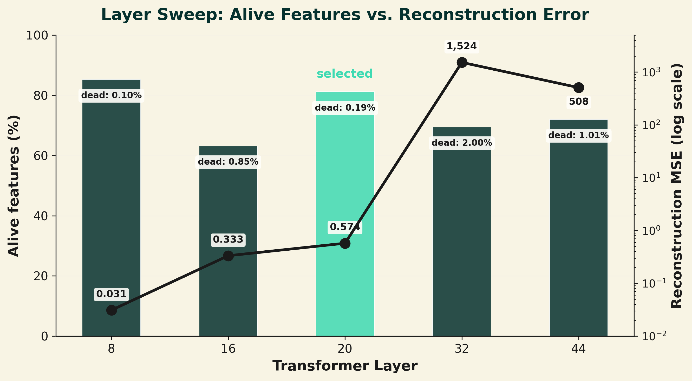
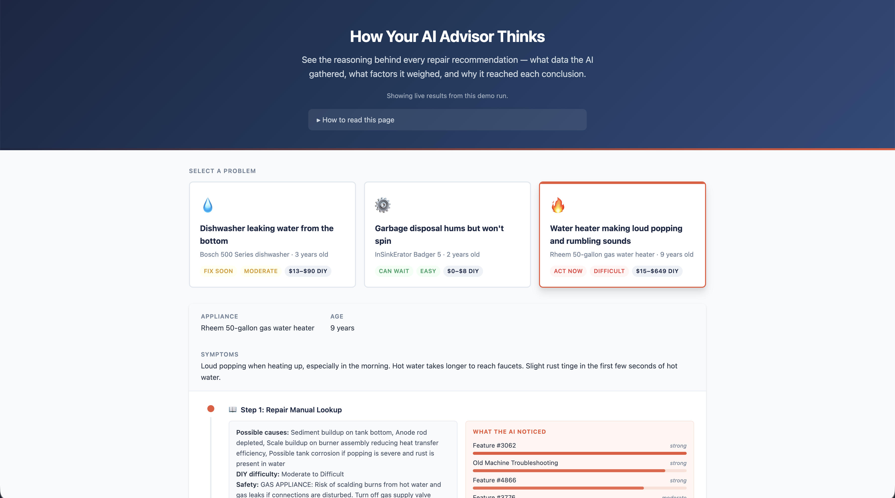

<style>
/* ─── Google Fonts ─────────────────────────────────────────────── */
@import url('https://fonts.googleapis.com/css2?family=DM+Sans:ital,opsz,wght@0,9..40,300;0,9..40,400;0,9..40,500;0,9..40,600;0,9..40,700;1,9..40,400&family=DM+Serif+Display:ital@0;1&family=DM+Mono:wght@400;500&display=swap');

/* ─── Brand Tokens ─────────────────────────────────────────────── */
:root {
  --core-black:       #0F1314;
  --core-white:       #FFFFFA;
  --dark-green:       #0A2A1F;
  --green:            #63FF91;
  --light-green:      #D1FFE6;
  --blue:             #7099FF;
  --dark-grey:        #1D2220;
  --dark-blue-grey:   #081030;
  --blue-grey:        #2B3B64;
  --light-blue-grey:  #ABCFFA;

  --ink:              var(--core-black);
  --ink-soft:         #4A5A55;
  --offwhite-bg:      #F4F7F2;

  --font-display:     'DM Serif Display', Georgia, serif;
  --font-sans:        'DM Sans', system-ui, sans-serif;
  --font-mono:        'DM Mono', 'Courier New', monospace;

  --radius:           12px;
  --gap:              2rem;

  --logo-white:       url('');
  --logo-black:       url('');
}

/* ─── Global Reset ─────────────────────────────────────────────── */
section {
  font-family: var(--font-sans);
  font-size:   20px;
  line-height: 1.6;
  color:       var(--ink);
  background:  var(--offwhite-bg);
  padding:     56px 72px;
  box-sizing:  border-box;
  width:  1280px;
  height: 720px;
  position: relative;
  overflow: hidden;
}

section::before {
  content:  '';
  position: absolute;
  top:    0;
  right:  0;
  width:  120px;
  height: 8px;
  background: var(--green);
}

section::after {
  font-family: var(--font-sans);
  font-size:   13px;
  font-weight: 500;
  color:       var(--blue-grey);
  bottom:      28px;
  right:       72px;
}

/* ─── Typography ───────────────────────────────────────────────── */
h1 {
  font-family: var(--font-display);
  font-size:   3.4rem;
  line-height: 1.1;
  color:       var(--dark-green);
  margin:      0 0 0.4em;
  letter-spacing: -0.02em;
}

h2 {
  font-family: var(--font-sans);
  font-size:   1.9rem;
  font-weight: 700;
  color:       var(--dark-green);
  margin:      0 0 0.5em;
  letter-spacing: -0.01em;
}

h3 {
  font-family: var(--font-sans);
  font-size:   1.2rem;
  font-weight: 600;
  color:       var(--blue-grey);
  margin:      0 0 0.35em;
  text-transform: uppercase;
  letter-spacing: 0.06em;
}

h4 {
  font-family: var(--font-sans);
  font-size:   1rem;
  font-weight: 600;
  color:       var(--ink-soft);
  margin:      0 0 0.25em;
}

p { margin: 0 0 1em; }

strong { color: var(--dark-green); font-weight: 700; }
em     { color: var(--blue-grey); font-style: italic; }

a {
  color:           var(--blue-grey);
  text-decoration: none;
  border-bottom:   1px solid var(--green);
}

ul, ol {
  padding-left: 1.4em;
  margin: 0 0 1em;
}

li { margin-bottom: 0.45em; }

li::marker { color: var(--dark-green); }

code {
  font-family:      var(--font-mono);
  font-size:        0.82em;
  background:       rgba(10,42,31,.08);
  color:            var(--dark-green);
  padding:          0.15em 0.4em;
  border-radius:    4px;
}

pre {
  background:    var(--core-white);
  color:         var(--dark-green);
  border:        1px solid rgba(10,42,31,.12);
  border-left:   4px solid var(--green);
  border-radius: var(--radius);
  padding:       1.4em 1.7em;
  font-size:     0.78em;
  line-height:   1.85;
  overflow:      hidden;
}

pre code {
  background: transparent;
  color:       inherit;
  padding:     0;
}

table {
  width:           100%;
  border-collapse: collapse;
  font-size:       0.88em;
}

thead tr {
  background:  var(--dark-green);
  color:       var(--core-white);
}

th {
  padding:     0.6em 1em;
  text-align:  left;
  font-weight: 600;
  letter-spacing: 0.03em;
}

td {
  padding:       0.55em 1em;
  border-bottom: 1px solid rgba(43,59,100,.2);
}

tr:nth-child(even) td {
  background: rgba(10,42,31,.04);
}

blockquote {
  border-left: 4px solid var(--green);
  padding:     0.5em 1.5em;
  margin:      1em 0;
  background:  rgba(99,255,145,.10);
  border-radius: 0 var(--radius) var(--radius) 0;
  font-style:  italic;
  color:       var(--ink-soft);
}

blockquote p { margin: 0; }

hr {
  border: none;
  height: 2px;
  background: linear-gradient(90deg, var(--green) 0%, var(--blue) 60%, transparent 100%);
  margin: 1.5em 0;
}

img {
  border-radius: var(--radius);
  max-width:     100%;
}

/* ─── Logo (575 Lab) ───────────────────────────────────────────── */
.logo {
  position: absolute;
  top:      40px;
  left:     72px;
  width:    140px;
  height:   28px;
  background-image:    var(--logo-black);
  background-repeat:   no-repeat;
  background-size:     contain;
  background-position: left center;
}

section.cover    .logo,
section.section  .logo,
section.dark     .logo,
section.closing  .logo {
  background-image: var(--logo-white);
}

section.closing .logo {
  top:     40px;
  left:    50%;
  transform: translateX(-50%);
  background-position: center;
}

/* ━━━ SLIDE VARIANTS ━━━ */

section.cover {
  background: var(--dark-green);
  color:      var(--core-white);
  padding:    80px 96px;
  display:    flex;
  flex-direction: column;
  justify-content: flex-end;
}

section.cover::before {
  width:   100%;
  height:  5px;
  background: linear-gradient(90deg, var(--green) 0%, var(--blue) 100%);
  top: 0;
  right: auto;
  left: 0;
}

section.cover::after { color: rgba(255,255,250,.4); }

section.cover h1 {
  font-size:   4.5rem;
  color:       var(--core-white);
  max-width:   100%;
  line-height: 1.05;
}

section.cover h2 {
  font-family: var(--font-sans);
  font-size:   1.25rem;
  font-weight: 400;
  color:       var(--light-green);
  margin-top:  0.6em;
  letter-spacing: 0;
}

section.cover p {
  color:     rgba(255,255,250,.65);
  font-size: 0.9rem;
}

section.cover strong { color: var(--light-green); }

section.section {
  background: var(--green);
  color:      var(--dark-green);
  display:    flex;
  flex-direction: column;
  justify-content: center;
  align-items: flex-start;
  padding:    80px 96px;
}

section.section::before { background: var(--dark-green); }
section.section::after  { color: rgba(10,42,31,.5); }

section.section h1,
section.section h2 {
  color:       var(--dark-green);
  font-size:   3rem;
  max-width:   70%;
}

section.section h3 {
  color:       var(--blue-grey);
  margin-bottom: 0.5em;
}

section.section p { color: rgba(10,42,31,.8); }

section.dark {
  background: var(--dark-blue-grey);
  color:      var(--core-white);
}

section.dark::before { background: var(--green); }
section.dark::after  { color: rgba(255,255,250,.4); }

section.dark h1,
section.dark h2 { color: var(--core-white); }
section.dark h3 { color: var(--light-blue-grey); }
section.dark strong { color: var(--light-green); }
section.dark em     { color: var(--light-blue-grey); }
section.dark a      { color: var(--light-green); border-bottom-color: var(--green); }

section.dark code {
  background: rgba(255,255,250,.10);
  color:      var(--light-green);
}

section.dark li::marker { color: var(--green); }

section.dark blockquote {
  border-left-color: var(--green);
  background:        rgba(99,255,145,.10);
  color:             rgba(255,255,250,.8);
}

section.light {
  background: var(--offwhite-bg);
  color:      var(--ink);
}

section.closing {
  background: linear-gradient(135deg, var(--dark-blue-grey) 0%, var(--dark-green) 60%, var(--blue-grey) 100%);
  color:       var(--core-white);
  display:     flex;
  flex-direction: column;
  justify-content: center;
  align-items: center;
  text-align:  center;
  padding:     80px;
}

section.closing::before {
  width:  100%;
  height: 5px;
  background: linear-gradient(90deg, var(--blue) 0%, var(--green) 100%);
  top:   0;
  right: auto;
  left:  0;
}

section.closing::after { color: rgba(255,255,250,.35); }

section.closing h1 {
  font-size: 3.8rem;
  color:     var(--core-white);
}

section.closing h2 {
  color:       var(--light-green);
  font-weight: 400;
  font-size:   1.3rem;
}

section.closing p {
  color:     rgba(255,255,250,.6);
  font-size: 0.9rem;
}

/* ─── Utility Classes ──────────────────────────────────────────── */
.badge {
  display:        inline-block;
  background:     var(--green);
  color:          var(--dark-green);
  font-size:      0.7em;
  font-weight:    700;
  letter-spacing: 0.08em;
  text-transform: uppercase;
  padding:        0.25em 0.75em;
  border-radius:  999px;
  margin-bottom:  0.6em;
}

.stat {
  font-family: var(--font-display);
  font-size:   3.5rem;
  color:       var(--dark-green);
  line-height: 1;
  display:     block;
}

.stat-label {
  font-size:   0.8rem;
  color:       var(--ink-soft);
  text-transform: uppercase;
  letter-spacing: 0.1em;
}

.cols {
  display:               grid;
  grid-template-columns: 1fr 1fr;
  gap:                   var(--gap);
  align-items:           start;
}

.cols-3 {
  display:               grid;
  grid-template-columns: 1fr 1fr 1fr;
  gap:                   var(--gap);
  align-items:           start;
}

.card {
  background:    var(--core-white);
  border:        1px solid rgba(43,59,100,.18);
  border-radius: var(--radius);
  padding:       1.25em 1.5em;
}

.tag {
  display:        inline-block;
  background:     rgba(112,153,255,.15);
  color:          var(--blue-grey);
  font-size:      0.72em;
  font-weight:    600;
  padding:        0.2em 0.65em;
  border-radius:  6px;
  letter-spacing: 0.04em;
}

.highlight {
  background:    linear-gradient(135deg, rgba(99,255,145,.14) 0%, rgba(112,153,255,.10) 100%);
  border-left:   4px solid var(--green);
  border-radius: 0 var(--radius) var(--radius) 0;
  padding:       1em 1.5em;
}
</style>

<!-- _class: cover -->

<div class="logo"></div>


# Opening the Black Box

## Mechanistic Interpretability for AI Agent Tool Selection Using Sparse Autoencoders

<p><strong>Hannes Hapke</strong> with <strong>David Cardozo</strong> · 575 Lab, Dataiku Inc.</p>

<p style="position:absolute;top:180px;right:72px;width:110px;text-align:center;font-size:0.7rem;color:rgba(255,255,250,.65);margin:0;">Scan to follow along</p>

<!--
Welcome the audience. Frame the talk in one sentence: today we're going to look inside an AI agent's head while it picks a tool, using sparse autoencoders. This is joint work with David Cardozo at 575 Lab, Dataiku's open source research office. Keep this slide short - 20 seconds max. Point at the QR briefly - tell them they can scan to follow along, all the code and pre-trained SAEs are open.
-->

---

<!-- _class: dark -->

<div class="logo"></div>

<span class="badge">About the Speaker</span>

## Hi, I'm Hannes Hapke

<div class="cols">

<div>
    <p><strong>Director, Engineering</strong> at Dataiku, 575 Lab <br>
    <strong>Google Developer Expert</strong> -- Machine Learning</p>

Focus areas:
- Open Source Machine Learning
- Production ML systems & pipelines
- Generative AI and agentic systems
</div>

<div>

Co-author of four O'Reilly & Manning books, including:
  - **Generative AI Design Patterns** (2025)
  - **Machine Learning Production Systems** (2024)

</div>

</div>

<p></p>
<p style="text-align: center;"><strong>Find me:</strong> hanneshapke.com • github.com/hanneshapke • linkedin.com/in/hanneshapke</p>

<!--
Quick personal intro. I lead engineering at Dataiku's 575 Lab and I'm a Google Developer Expert for ML. My background is production ML pipelines - which is why this project obsesses about packaging, vLLM patches, and reproducibility, not just the science. Co-authored four books, most recently Generative AI Design Patterns. Don't read the bullets - just pick one focus area to riff on. Move on in under 45 seconds.
-->

---

<!-- _class: dark -->

<!--<div class="logo"></div>-->

<span class="badge">About the Lab</span>

## Dataiku's Open Source Office

<div class="cols">

<div>


**Advancing Responsible AI through open source** &mdash; production-ready tools that give enterprises **transparency, control, and governance** to deploy AI with confidence.

Our Responsible AI work:
- **Trust** &mdash; no black boxes, no hidden behaviour
- **Control** &mdash; no vendor lock-in, no opaque dependencies
- **Accountability** &mdash; auditable, reproducible, community-reviewed

</div>

<div>

### Signature projects

- **Kiji Inspector** &mdash; mechanistic interpretability for agent tool selection *(this talk)*
- **Kiji Privacy Proxy** &mdash; detect &amp; redact sensitive data before LLM API calls

### Also contributing to

vLLM &middot; scikit-learn (sponsor) &middot; Cardinal (active learning) &middot; CodeMirror

[dataiku.com/open-source](https://www.dataiku.com/open-source)

</div>

</div>

<!--
575 Lab is Dataiku's open source office. Our charter is Responsible AI you can actually ship - meaning transparency, control, and accountability are non-negotiable. Two flagship projects: Kiji Inspector (today's talk) and Kiji Privacy Proxy (PII redaction before LLM calls). We also sponsor scikit-learn and contribute upstream to vLLM. Key point: interpretability isn't a research curiosity for us, it's a deployment requirement.
-->

---

## The Problem: Opaque Agent Decisions

AI agents autonomously select tools (databases, web search, code execution, ...) 
based on natural language requests.
But **why**?

> "Find information about *our company's* API rate limits."
> &rarr; Internal docs search? Or public web search?

Current approaches **fail** to provide mechanistic insight:

1. **Prompt engineering** -- reveals correlations, not causal mechanisms
2. **Behavioral testing** -- characterizes inputs/outputs, not internals
3. **Chain-of-thought** -- plausible narratives $\neq$ true computation

<div class="highlight">

We need to look **inside the model**.

</div>

<!--
Set the stakes. Modern agents pick from dozens of tools - databases, web search, code execution, file writes - based on a single natural language sentence. When it goes wrong (privacy leak, wrong data source, irreversible action), the question "why did it pick that?" has no good answer today. Walk through the three failure modes: prompt engineering only finds correlations; behavioral tests only see I/O; chain-of-thought is plausible storytelling that often doesn't match the actual computation. The Anthropic faithfulness work is a good reference if anyone asks. Land on the punchline: we need to look inside the model.
-->

---

<!-- _class: section -->

<div class="logo"></div>

### Part I

# The Solution

### Looking Inside with Sparse Autoencoders

<!--
Section transition - 5 seconds. Three-step build coming: autoencoders, then sparse autoencoders, then how we read the features. Audience may not have interpretability background, so I'm grounding the technique from first principles before showing what we did with it.
-->

---

## How to Understand Models &mdash; Step 1

### Autoencoders

A **self-supervised** technique that learns new representations: compress an input through a bottleneck, then reconstruct it. What survives the bottleneck is what the model considers essential.


<!--- **No labels required** -- the input *is* the target-->
- **Well-understood** -- decades of theory and practice
- **Lossy by design** -- the bottleneck forces the model to *prioritise*

<!--
Start from the textbook autoencoder: compress to a bottleneck, reconstruct, train on reconstruction loss. The point isn't the reconstruction - it's that whatever survives the squeeze is what the model decided was essential. Self-supervised: no labels needed because the input is also the target. This is the foundation; the next slide is the twist.
-->

---

## How to Understand Models &mdash; Step 2

### Sparse Autoencoders (SAE)

Flip the autoencoder on its head: instead of compressing, **expand** the latent space &mdash; but force fewer than **5%** of dimensions to fire on any given input.


<!--- **Overcomplete dictionary** -- latent space is *wider* than the input-->
<!--- **Monosemantic features** -- each dimension tends to track one human-interpretable concept-->
<!--- **Sparsity constraint** -- $L_0 < 5\%$ of features active per token-->

<!--
Here's the counterintuitive flip: instead of squeezing the representation smaller, expand it - sometimes 4x to 16x wider than the input - but force the model to use fewer than 5% of those dimensions for any single example. Why this works: dense activations are polysemantic (one neuron means many things). The sparsity constraint pushes the network toward monosemantic features - each dimension tends to track one human-interpretable concept. This is the Anthropic/EleutherAI line of work; namedrop Bricken 2023 if anyone asks for a primary reference.
-->

---

## How to Understand Models &mdash; Step 3

### Interpreting What the Features Mean

A trained feature is just an index. To *label* it, collect the contexts where it fires most strongly &mdash; then let an LLM describe the pattern.


- **Feature &rArr; contexts** -- gather the top-*k* token spans that maximally activate each feature
- **Auto-interpretation** -- an LLM proposes a short natural-language label from those examples
- **Themes emerge** -- many features cluster around tool-relevant concepts (syntax, scope, error language)

<!--
After training, a feature is just an integer index - feature 14641, feature 2341 - it has no name. To label it: for each feature, collect the contexts (token spans) where it activates most strongly, then hand those to an LLM and ask "what's the common pattern?" This is autointerp - the standard recipe from EleutherAI. We use it both to assign labels and as a basis for the stricter evaluation we'll show later. End by previewing: themes emerge naturally - syntax, scope, intent type - all without us defining a taxonomy.
-->

---

## What's Novel?

<div class="cols" style="grid-auto-rows: 1fr; align-items: stretch;">

<div class="card">

<span class="badge">01</span>

### Decision-Token Extraction

Capture activations at the *precise moment* of tool commitment &mdash; not averaged over the prompt.

</div>

<div class="card">

<span class="badge">02</span>

### Pairs as Post-hoc Probes

The SAE learns the model's natural vocabulary **unsupervised**. Contrastive pairs are statistical probes only &mdash; never training signal.

</div>

<div class="card">

<span class="badge">03</span>

### Token-Level Fuzzing Evaluation

Adapted from Eleuther AI's autointerp &mdash; catches labels that are *"right for the wrong reasons."*

</div>

<div class="card">

<span class="badge">04</span>

### Causal Validation via Ablation

Zero a feature, measure the prediction flip &mdash; turns correlations into evidence.

</div>

</div>

<!--
Now the research contributions - what's different from prior SAE work. (1) Decision-token extraction: most SAE work pools activations across a whole sequence; we grab the exact token where the model commits to a tool name. (2) Contrastive pairs are used post-hoc as probes - they never enter the SAE training signal, so the SAE learns the model's natural feature vocabulary unsupervised. (3) Token-level fuzzing - we tightened EleutherAI's autointerp by evaluating at the token, not the prompt, so a feature can't get credit for matching the topic if it doesn't match the token. (4) Causal ablation - the difference between "this feature correlates with the decision" and "this feature is necessary for the decision." We'll see results for all four later.
-->

---

## Our Complete Training Pipeline


The SAE is trained unsupervised on the activations; contrastive pairs serve only as post-hoc statistical probes.

<!--
Walk through the diagram left to right. Start: generate ~500K contrastive pairs from scenario JSON files. Run them through the subject model and harvest the decision-token activations - one vector per pair. That's the SAE training corpus. Train the JumpReLU SAE on those activations - unsupervised. Then, post-hoc, we use the contrastive pair labels to identify which features differentiate between tool A and tool B. Emphasize: the pair labels never enter the SAE loss. The SAE learns the model's vocabulary; we use the pairs to read it.
-->

---

## Nemotron-3 Nano Architecture


Hybrid Mamba2-Transformer MoE, 52 layers, open weights &mdash. We extract activations at **layer 20** (GQA attention).

<!--
For the main results we used Nemotron-3 Nano 30B. Why this one: hybrid Mamba2-Transformer MoE, 52 layers, fully open weights, and large enough to do real tool use - but small enough to extract a million activations affordably. We hook at layer 20 - a grouped-query attention block - and the rationale for layer 20 specifically comes later in the layer sweep slide. If the audience asks about MoE: routing happens post-layer-32 in this architecture, which is why we stay below it.
-->

---

## PyTorch SAE Model Architecture


Encoder projects 2,688-dim input to 10,752 sparse features via JumpReLU with learnable per-feature thresholds. 

<!--Decoder reconstructs with unit-norm columns. Shared bias b_dec centers the input.-->

<!--
This is the architecture of our SAE itself. Input is the 2,688-dim hidden state from Nemotron layer 20. Encoder projects up to 10,752 features - 4x expansion. JumpReLU gating with one learnable threshold per feature gives true zeros without breaking gradients. Decoder is a linear layer with unit-norm columns - that constraint keeps features from absorbing magnitude into the dictionary vector. Shared bias b_dec centers the input. Don't dwell on the math here - the equations come two slides later. Just establish: this is the model we trained.
-->

---

## Decision Token Extraction

Every formatted prompt ends with:
```
<|assistant|> I'll use the '
```

The hidden state at this final token is the **decision token** -- the model's internal state at the moment it commits to a tool name.

- Activations extracted at **layer 20** of Nemotron-3-Nano-30B (54-layer MoE) &mdash; *layer choice justified below*
- Hidden dimension: **2,688**
- Batched extraction with left-padding for alignment
- Dataset: **1,000,000** activation vectors (500K contrastive pairs)

<!--
Key idea of the slide: where in the sequence do we look? Most SAE work pools activations across the whole prompt. We don't - we grab one specific token: the hidden state at "I'll use the '" - literally the position where the next token will be the tool name. That's the model's internal state at the moment of commitment. Two reasons this matters: (1) cleaner signal - no averaging over irrelevant context, (2) directly causal for the tool choice we're trying to explain. Dataset: a million activation vectors from 500K contrastive pairs (two activations per pair).
-->

---

## Contrastive Pair Design

Pairs share the same *intent* but require *different tools*:

| Shared Intent | Anchor (tool A) | Contrast (tool B) |
|---|---|---|
| Resolve password issue | "How do I reset my password?" &rarr; `knowledge_base` | "I tried resetting 3 times but the email never arrives" &rarr; `ticket_lookup` |
| Evaluate energy stocks | "Which companies invest in renewables?" &rarr; `financial_analysis` | "Which stocks trade below book value?" &rarr; `market_data_lookup` |
| Check product version | "What is the latest version?" &rarr; `file_read` | "Set the version to v3.2.1" &rarr; `file_write` |

5 domains, 32 tools, 37 contrast types.

<!--
The design principle: each pair has the SAME underlying intent but routes to DIFFERENT tools because of a subtle linguistic distinction. First row: both want password help, but "I tried 3 times" implies an existing problem - that flips knowledge_base into ticket_lookup. Same for read vs write - "what is" vs "set the". The point of isolating these single-axis differences is that any feature that fires differently on the two halves is *probably* tracking that specific distinction. 5 domains times ~7 contrast types each gives the 37 contrasts we used. Tool count is 32 total across all domains.
-->

---

## JumpReLU SAE Architecture

*JumpReLU = ReLU with a learnable per-feature threshold &mdash; gives exact zeros but stays trainable via tanh pseudo-gradients (Rajamanoharan et al., 2024).*

**Encoder:**
$$f_i(\mathbf{x}) = \pi_i(\mathbf{x}) \cdot H(\pi_i(\mathbf{x}) - \theta_i)$$

where $\pi_i(\mathbf{x}) = [W_{\text{enc}}(\mathbf{x} - \mathbf{b}_{\text{dec}}) + \mathbf{b}_{\text{enc}}]_i$ and $\theta_i$ is a learnable threshold.

**Key properties:**
- **Exact sparsity** -- Heaviside step function $H$ produces true zeros
- **Smooth training** -- tanh approximation for gradient flow:
$$\hat{\mathcal{L}}_{\text{sparse}} = \sum_{i=1}^{M} \text{ReLU}\!\left(\tanh\!\left(\frac{\pi_i - \theta_i}{\varepsilon}\right)\right)$$
- **Pseudo-gradients** via rectangular kernel density estimator

Dictionary size $M = 16{,}384$ ($4 \times$ hidden dim).

<!--
This is the math slide for the ML audience. The problem with regular ReLU SAEs is that the sparsity penalty is an L1 norm, which biases features toward zero magnitude even when active - it shrinks the very signal you want to keep. TopK SAEs fix that but lose differentiability. JumpReLU (Rajamanoharan 2024, DeepMind) splits the difference: a Heaviside step function gives true zeros, but the gradient is approximated through a tanh kernel so the optimizer can still move thresholds smoothly. Each feature has its own learnable threshold theta_i. Dictionary is 16,384 - 4x the 4,096 hidden dim of the model we did the math on for this slide. (Nemotron Nano is 2,688 -> 10,752 in practice; the formula is identical.) Don't read the equations - point at them and move on unless the audience is hungry.
-->

---

## Why Layer 20?



- Layers 8/16: low MSE but *pre-decision* representations
- **Layer 20**: best alive %, lowest dead %, MSE < 1.0
- Layers 32+: MoE expert routing &rarr; 500x+ higher MSE

<!--
We swept SAEs across multiple layers and three things showed up. Layers 8 and 16 look great on MSE but the representations are pre-decision - the model hasn't finished integrating context yet, so features are about surface form, not tool choice. Layer 20 hits the sweet spot: highest fraction alive features, lowest dead, reconstruction MSE under 1.0. After layer 32 the architecture hits MoE routing and MSE jumps 500x because the residual stream becomes fundamentally different per expert. Lesson: layer choice is not a hyperparameter to be swept randomly - it has to land on a representation that's *about* the thing you're trying to interpret.
-->

---

## SAE Feature Health (Layer 20, Full Dataset)

| Metric | Value |
|--------|-------|
| Total features | 10,752 |
| Alive features (>0.1% firing) | **81.2%** [80.6, 81.8] |
| Dead features (0% firing) | **0.19%** [0.13, 0.27] |
| L0 (active features per input) | 668 (&asymp;4.1% density) |
| Reconstruction MSE | 0.574 |

The SAE efficiently uses its capacity: sparse encoding with high feature utilization.

<!--
Diagnostic stats for the SAE we'll use for the rest of the talk. 10,752 features total. 81% alive - they fire on >0.1% of inputs - this is the "is the dictionary actually being used" check. Dead features are 0.19% - vanishingly few of the 10,752 are wasted. L0 is 668 features per input, about 4% density - that's the sparsity we trained for. Reconstruction MSE 0.574 means the SAE rebuilds the original activation with low residual error. Together these say: the model isn't degenerate, isn't over-sparse, isn't under-sparse. It's healthy and any downstream claims about features mean something.
-->

---

## Baselines: Why Not Just a Probe?


- Linear probe confirms tool identity is *linearly encoded* (79.6% across 32 classes) -- but provides *no interpretability*
- PCA + k-means fails entirely -- tool signal is not dominant variance
- The SAE bridges this gap: **interpretable** *and* **causally testable** features

<!--
Anticipate the obvious challenge: "if you just want to know which tool the model picks, train a linear probe - way simpler than an SAE." So we did. The linear probe gets 79.6% across 32 tools - decent. That confirms tool identity IS linearly encoded in the activations - we're looking in the right place. But a linear probe gives you a weight vector you can't read - no interpretation. PCA plus k-means fails entirely because tool signal isn't dominant variance - it's a tiny direction inside the residual stream. The SAE wins because it gives you both: interpretable features AND something you can ablate to test causality. Probes can't be ablated meaningfully because they don't sit inside the model.
-->

---

## Token-Level Fuzzing Evaluation

*Autointerp (EleutherAI) is the standard recipe for labelling SAE features at scale: an LLM proposes a label from top-activating contexts, a second LLM judges whether the label predicts activation. We tighten the test.*

Standard evaluation: "Does this label predict which *prompts* activate the feature?"
Our evaluation: "Does this label predict which *tokens* activate the feature?"

**Protocol:**
1. Extract per-token activations across entire prompt
2. Highlight top-K tokens in user request span
3. A/B test: LLM judge picks which highlighted text matches the label
4. Randomized order to prevent position bias

**Combined score** = $0.7 \cdot \text{acc}_{\text{token}} + 0.3 \cdot \text{acc}_{\text{prompt}}$

Token-level gets higher weight because it tests the *actual mechanism*.

<!--
EleutherAI's autointerp is the standard recipe for evaluating SAE feature labels: an LLM proposes a label, a second LLM acts as judge and decides whether the label predicts activation. The trouble is judges work at the prompt level - they only see the whole text. A label like "Python code" can pass on a Python-related prompt even if the feature actually fires on a Java token in that prompt. That's "right for the wrong reasons". Our fix: highlight the specific tokens the feature actually fires on, A/B against random tokens, randomize order, and ask the judge to pick which highlighted text matches the label. That tests the actual mechanism. We weight token-level 70/30 because it's the stricter test.
-->

---

## Fuzzing Results: Features Are Interpretable


- **402 features**, combined score **0.912 &plusmn; 0.008** (p < 10^-4)
- Token-level accuracy: **0.906 &plusmn; 0.007**
- Emergent features without supervision: "internal knowledge retrieval",
  "data modification intent", "query complexity"

<!--
402 features survived our quality filter. Combined fuzzing score 0.912 with very tight error bars - p-value below 10^-4 versus chance. Token-level alone is 0.906 - the harder test almost equals the combined score, which means the labels are genuinely about the tokens the feature fires on, not just the topic of the prompt. Notice the examples of emergent features at the bottom: "internal knowledge retrieval", "data modification intent", "query complexity" - we never defined these concepts, we never gave them labels, the SAE discovered them and autointerp named them. That's the unsupervised story landing.
-->

---

<!-- _class: section -->

<div class="logo"></div>

### Part II

# The Causality Test

From Correlation to Causal Evidence

<!--
Section transition. Everything so far is correlational - "these features fire when the model picks tool A". The next four slides answer the harder question: are those features doing the work, or just along for the ride? This is where we earn the right to say "the model picks tool A because of feature X". Brief pause here, then dive in.
-->

---

## Feature Ablation: Experimental Design

**Question:** Are contrastive features *causally necessary* for tool selection, or merely correlated?

**Method:**
1. Intercept residual stream at layer 20
2. Encode through trained SAE
3. **Zero out top-10 contrastive features**
4. Decode back into residual stream
5. Measure: does the model's tool prediction *flip*?

**Controls:**
- **Random ablation**: zero 10 random non-contrastive features
- **Reconstruction-only**: SAE encode &rarr; decode with *no* features zeroed (measures round-trip distortion)

<!--
Experimental setup. We intercept the residual stream at layer 20, encode through the trained SAE, zero the top-10 contrastive features for the relevant contrast, decode back into the residual stream, and let the model finish its forward pass. If the model now picks a different tool, the feature mattered causally. Two controls are critical. Random ablation: zero 10 random non-contrastive features - asks "would zeroing ANY 10 features have done this?" Reconstruction-only: encode-decode with no zeroing - measures the distortion the SAE itself introduces. Both controls have to be near zero for our contrastive ablation effect to mean anything.
-->

---

## Ablation Results: Causal Evidence


**Aggregate (23 types):** 16.1% contrastive vs. 13.0% reconstruction-only

<!--
Headline result aggregated across 23 contrast types: 16.1% prediction flip rate with contrastive ablation versus 13.0% from reconstruction-only baseline. The gap is small but the direction matters - removing the *specific* features we identified does more damage than the SAE's reconstruction noise alone. The aggregate hides huge variance though: some contrast types show big causal effects, others show none. The next two slides unpack that.
-->

---

## Why This Matters: Interpreting the Ablation

**Fundamental vs. Technical Analysis** (p = 0.002):
- Zeroing 10 contrastive features flips **10.1%** of predictions
- 9.0% flip *toward the contrast tool* (directed change)
- Random ablation: **0%** flips. Reconstruction-only: **0%** flips
- These features are *causally necessary* for this distinction

**Critical control insight:**
> Random ablation flip rate *equals* SAE round-trip distortion across all 23 contrast types. Removing 10 random features from ~668 active adds *no disruption beyond the encode-decode cycle itself*.

This validates the design: ablation effects are due to *specific features*, not general signal degradation.

<!--
Drill into the cleanest case: fundamental vs technical financial analysis. Ablating 10 specific contrastive features flips 10.1% of predictions, p=0.002. 9 out of 10 percentage points flip *toward the contrast tool* - the direction we'd expect if we'd removed exactly the signal driving the choice. Random ablation: 0% flips. Reconstruction-only: 0% flips. So on this contrast, neither generic noise nor SAE distortion could have produced the effect - it has to be the specific features. Highlight the methodological win: random ablation rate equaling reconstruction-only rate across all 23 contrasts means our SAE adds essentially no spurious damage. That's what justifies attributing the contrastive effect to specific features rather than general degradation.
-->

---

## The Spectrum of Causal Involvement

Not all decisions rely on sparse feature circuits. Across 23 contrast types we see a spectrum:

- **Sparse circuits** -- a small minority (e.g. fundamental/technical, single/multi-tool) concentrate causal signal in a handful of identifiable features; ablating 10 contrastive features flips up to 10.1% of predictions
- **Distributed encodings** -- many contrast types (e.g. preventive/reactive maintenance) show 0% flips even with 10 features ablated, robust to any 10-feature subset
- **Intermediate** -- the remainder show detectable but not statistically dominant feature involvement

This reveals a heterogeneous landscape:
> Some tool-selection decisions are governed by interpretable sparse circuits; others rely on distributed, redundant encodings.

Both findings are scientifically valuable.

<!--
This is the honest reading of the full ablation table. Not every tool-selection decision sits on a sparse, identifiable circuit. About a third of contrasts (the cleanest cases like fundamental/technical, single/multi-tool) show large effects from ablating just 10 features - those are sparse circuits we can name and intervene on. Another chunk - including preventive/reactive maintenance - shows 0% flips even after we ablate 10 features. That doesn't mean nothing is there - it means the signal is distributed across many features redundantly, so any 10-subset leaves the decision intact. The third bucket is in between. The scientifically honest story: tool selection is heterogeneous - sometimes sparse, sometimes distributed - and Kiji Inspector lets us tell which is which. That's a useful diagnostic on its own.
-->

---

<!-- _class: section -->

<div class="logo"></div>

### Part III

# Using Kiji Inspector

### From research to production

<!--
Section transition into the practical side. The previous two sections established what SAEs can discover and that the features carry causal weight. Now we shift gears: how does a practitioner actually use this? We'll show the API, the supported models, and walk through a code example before the live demo.
-->

---

## The Kiji Inspector


<div class="cols">

<div class="card">

<span class="badge">01</span>

### Model Agnostic

Framework to train custom Sparse Autoencoders &mdash; works on **any open-source LLM**, not just the ones we tested.

</div>

<div class="card">

<span class="badge">02</span>

### End-to-end Training Pipeline

No custom training setup needed. The project **generates the contrastive datasets** for you and runs the full extract &rarr; train &rarr; analyse loop.

</div>

</div>

<div class="cols">

<div class="card">

<span class="badge">03</span>

### Production Inference Support

vLLM patches, single-endpoint Docker containers, and PyPI packages &mdash; ready to drop into a live serving stack.

</div>

<div class="card">

<span class="badge">04</span>

### Fully Open Source

Pre-trained SAE models distributed via **Hugging Face**, **Docker Hub**, and **PyPI** &mdash; reuse without retraining.

</div>

</div>

GitHub: [github.com/dataiku/kiji-inspector](https://github.com/dataiku/kiji-inspector)

<!--
This is the product pitch slide - what we shipped, not what we discovered. Four pillars: (1) model agnostic - we tested on Nemotron and Gemma but the framework runs on any HuggingFace causal LM, (2) end-to-end - we generate the contrastive datasets too, no manual labeling needed, (3) production-ready inference - vLLM patches and Docker containers so this drops into a live serving stack, (4) open source - pre-trained SAEs already on Hugging Face for several models, so most users can skip training entirely. Point at the QR - this is the highest-intent moment in the talk, anyone who's about to be sold should scan now.
-->

---

## Supported Language Models

| Huggingface Model | Link | Kiji Inspector Sparse Autoencoder | Supported Layers |
|---|---|---|---|
| `google/gemma-3-27b-it` | [model](https://huggingface.co/google/gemma-3-27b-it) | [575-lab/kiji-inspector-google-gemma-3-27b-it](https://huggingface.co/575-lab/kiji-inspector-google-gemma-3-27b-it) | 10 20 31 41 50 58 |
| `google/gemma-4-26B-A4B-it` | [model](https://huggingface.co/google/gemma-4-26B-A4B-it) | [575-lab/kiji-inspector-google-gemma-4-26B-A4B-it](https://huggingface.co/575-lab/kiji-inspector-google-gemma-4-26B-A4B-it) | 11 14 17 20 23 |
| `google/gemma-4-E4B-it` | [model](https://huggingface.co/google/gemma-4-E4B-it) | [575-lab/kiji-inspector-google-gemma-4-E4B-it](https://huggingface.co/575-lab/kiji-inspector-google-gemma-4-E4B-it) | 11 17 23 29 35 |
| `google/gemma-4-E2B-it` | [model](https://huggingface.co/google/gemma-4-E2B-it) | [575-lab/kiji-inspector-google-gemma-4-E2B-it](https://huggingface.co/575-lab/kiji-inspector-google-gemma-4-E2B-it) | 13 14 15 18 19 20 23 24 25 |
| `nvidia/Nemotron-3-Super-120B-A12B-FP8` | [model](https://huggingface.co/nvidia/NVIDIA-Nemotron-3-Super-120B-A12B-FP8) | [575-lab/kiji-inspector-NVIDIA-Nemotron-3-Super-120B-A12B-FP8](https://huggingface.co/575-lab/kiji-inspector-NVIDIA-Nemotron-3-Super-120B-A12B-FP8) | 15 27 45 57 69 81 |
| `nvidia/Nemotron-3-Super-120B-A12B-BF16` | [model](https://huggingface.co/nvidia/NVIDIA-Nemotron-3-Super-120B-A12B-BF16) | [575-lab/kiji-inspector-NVIDIA-Nemotron-3-Super-120B-A12B-BF16](https://huggingface.co/575-lab/kiji-inspector-NVIDIA-Nemotron-3-Super-120B-A12B-BF16) | 15 27 45 57 69 81 |
| `nvidia/NVIDIA-Nemotron-3-Nano-30B-A3B-BF16` | [model](https://huggingface.co/nvidia/NVIDIA-Nemotron-3-Nano-30B-A3B-BF16) | [575-lab/kiji-inspector-NVIDIA-Nemotron-3-Nano-30B-A3B-BF16](https://huggingface.co/575-lab/kiji-inspector-NVIDIA-Nemotron-3-Nano-30B-A3B-BF16) | 8 17 20 26 35 44 |
| `nvidia/NVIDIA-Nemotron-3-Nano-30B-A3B-FP8` | [model](https://huggingface.co/nvidia/NVIDIA-Nemotron-3-Nano-30B-A3B-FP8) | [575-lab/kiji-inspector-NVIDIA-Nemotron-3-Nano-30B-A3B-FP8](https://huggingface.co/575-lab/kiji-inspector-NVIDIA-Nemotron-3-Nano-30B-A3B-FP8) | 8 17 20 26 35 44 |
| `nvidia/NVIDIA-Nemotron-3-Nano-30B-A3B-NVFP4` | [model](https://huggingface.co/nvidia/NVIDIA-Nemotron-3-Nano-30B-A3B-NVFP4) | [575-lab/kiji-inspector-NVIDIA-Nemotron-3-Nano-30B-A3B-NVFP4](https://huggingface.co/575-lab/kiji-inspector-NVIDIA-Nemotron-3-Nano-30B-A3B-NVFP4) | 8 17 20 26 35 44 |

<!--
Skip the table quickly - it's a reference slide. The point: pre-trained SAEs are already on Hugging Face under the 575-lab org for Gemma 3 (1B/4B/27B), Gemma 4 (multiple variants including E2B/E4B), and Nemotron-3 across Nano 30B (BF16/FP8/NVFP4) and Super 120B (BF16/FP8). For each model we ship multiple layers so you can pick the one that matches your decision point. If anyone is on a supported model they can skip training entirely - that's the whole point of the open release.
-->

---

## Our Inference Setup


Seven steps from raw prompts to human-readable decision explanations.

<!--
This is the runtime story - what happens after the SAE is trained. A user request comes in, the subject model selects a tool, and in parallel we capture the decision-token activation, pass it through the SAE, look up the top-firing features in the labeled dictionary, and emit a human-readable rationale alongside the tool call. The whole thing runs as a single Docker container on the vLLM side. Don't dwell on every arrow - the point is that interpretation is online, not a separate offline analysis.
-->

---

## Hands-on: Extract a Layer's Activations

The Kiji Inspector builds on standard PyTorch primitives. Here's the extraction step in raw `transformers` &mdash; the same mechanism, no Kiji magic, on any HuggingFace causal LM.

```bash
pip install -U -q kiji-inspector transformers
```

<!--
Pivoting from research narrative to a live code walkthrough. The point of the next six slides is: this is plain PyTorch + HuggingFace - no Kiji magic for the extraction step. We're deliberately showing the raw mechanism first so people see the SAE is layered on top of standard infrastructure they already know. After the code walkthrough we'll bring in the Kiji Inspector API and show the payoff. One pip install, two libraries.
-->

---

## Setup &mdash; Imports & Config

```python
import torch
from transformers import AutoModelForCausalLM, AutoProcessor

LAYER_INDEX = 8
MODEL_ID    = "google/gemma-4-E4B-it"
PROMPT      = "My dishwasher is smelly, what is the first element I should review?"
```

Pick the **layer** to study and the **model** to study it on. Everything else flows from these three constants.

<!--
Just three constants drive everything: which layer, which model, what prompt. Layer 8 here because we're demonstrating on Gemma 4 E4B which is smaller than Nemotron - the analogous "decision-near" layer is shallower. Use the dishwasher prompt deliberately - it's mundane and shows the system handles non-toy domains. Move through this slide in 15 seconds.
-->

---

## Load Model & Processor

```python
processor = AutoProcessor.from_pretrained(MODEL_ID)
model = AutoModelForCausalLM.from_pretrained(
    MODEL_ID,
    torch_dtype=torch.bfloat16,
    device_map="auto",
)
model.eval()
```

`bfloat16` halves memory; `device_map="auto"` lets HF Accelerate place layers across GPUs. `.eval()` disables dropout &mdash; we want deterministic activations.

<!--
Three details worth pointing out: bf16 because we don't need fp32 precision for forward-only inference - it halves memory and the SAE can absorb the noise. device_map=auto lets HF Accelerate split layers across whatever GPUs are available. eval mode disables dropout - critical because we want the *same* activation every time we run the same prompt, otherwise our SAE features become noisy.
-->

---

## Format the Prompt

```python
messages = [{"role": "user", "content": [{"type": "text", "text": PROMPT}]}]
prompt = processor.apply_chat_template(
    messages, tokenize=False, add_generation_prompt=True,
)
inputs = processor(text=prompt, return_tensors="pt")
inputs = {k: v.to(next(model.parameters()).device) for k, v in inputs.items()}
```

`add_generation_prompt=True` appends the assistant turn header &mdash; the model is now poised to *answer*. That final position is the **decision token** we just defined.

<!--
The crucial flag here is add_generation_prompt=True. Without it, you tokenize "user said X" - with it, you tokenize "user said X, assistant is about to respond starting with...". That final cursor position is the decision token from earlier in the talk. This is where the model's internal state has converged on what it's going to do next. Everything else on this slide is boilerplate device handling.
-->

---

## Capture Activations with a Forward Hook

```python
captured = {}

def hook(_module, _inputs, output):
    hidden = output[0] if isinstance(output, tuple) else output
    captured["tensor"] = hidden.detach().cpu()

layer = model.model.language_model.layers[LAYER_INDEX]
handle = layer.register_forward_hook(hook)
```

PyTorch's `register_forward_hook` intercepts the layer's output mid-forward-pass. We `.detach()` to drop the autograd graph and `.cpu()` so we don't pin GPU memory.

<!--
This is the meat. register_forward_hook is a one-line PyTorch primitive that lets you intercept a layer's output mid-forward-pass without modifying the model code. The hook stuffs the hidden state into a captured dict. Two important hygiene moves: detach() drops the autograd graph (we're not training), and cpu() moves the tensor off GPU so we don't accidentally pin a million activations in VRAM during dataset construction. This same code pattern scales from one example to a million.
-->

---

## Run Inference, Retrieve the Tensor

```python
try:
    with torch.inference_mode():
        model(**inputs)
finally:
    handle.remove()

hidden_state = captured["tensor"]
```

`inference_mode()` is faster than `no_grad()` &mdash; it also skips view-tracking. The `try / finally` guarantees the hook is removed even on error. `hidden_state` is ready to feed into a trained SAE.

<!--
Two craft notes here. inference_mode is strictly faster than no_grad because it also skips view-tracking - matters at scale. The try/finally guarantees the hook handle is removed even if the forward pass raises - otherwise hooks accumulate silently and you start capturing other people's tensors. After this block, hidden_state is just a regular CPU tensor ready to feed into the SAE. That's the handoff to the next slide.
-->

---

## Now: Ask the Kiji Inspector What Fired

```python
from kiji_inspector import SAE

sae, feature_descriptions = SAE.from_pretrained(
    base_model="google/gemma-4-E4B-it",
    layer=8,
)

# Activation for the first sequence, last token
last_token_act = hidden_state[0, -1, :]

# Describe the top features activating on this token
sae.describe(last_token_act, feature_descriptions)
```

`SAE.from_pretrained` pulls a layer-matched SAE *and* its labelled feature dictionary from the Hub. `describe()` returns the highest-activating features and their human-readable labels &mdash; the decision token, explained.

<!--
This is the payoff slide. Three lines: load a layer-matched SAE *and* its labeled feature dictionary from the Hub, slice out the last-token activation, call describe(). That's the whole user experience. The HF-style API is deliberate - same ergonomics as transformers, drops into any existing pipeline. If audience is wondering why we ship the feature dictionary alongside the weights: features are model-specific - their indices only make sense paired with the autointerp labels we generated. So we always distribute them together.
-->

---

## Output: Top Features on the Token

```python
[(2341, 'unknown', 7.57),
 (14641,
  {'label':           'Dishwasher Gasket Issues',
   'description':     'Detects descriptions of dishwashers leaking from '
                      'the door or bottom, often mentioning a worn, torn, '
                      'or cracked door gasket.',
   'confidence':      'high',
   'mean_activation': 7.66,
   'max_activation':  8.63,
   'frac_nonzero':    1.0,
   'top_examples':    ['My 18-yr-old dishwasher is leaking from the door...',
                       ...],
   'bottom_examples': ['Find general best practices for API versioning...',
                       ...]},
  7.19),
 ...]
```

A labelled feature (**#14641**) semantically matches the prompt &mdash; with full provenance (confidence, activation stats, witnessing contexts). Feature **#2341** fired too but autointerp hasn't named it. 

<!--
The prompt was about a smelly dishwasher. The top labeled feature - #14641 - is "Dishwasher Gasket Issues", and it fires hard (7.66 mean, 8.63 max). That's the model recognizing this is a dishwasher complaint via a feature it built unsupervised. Notice we ship full provenance: top examples (what activated it during training), bottom examples (what didn't), confidence, frac_nonzero. That's there to build trust - reviewers can audit whether a label is honest. Feature #2341 also fired but autointerp couldn't confidently label it - we surface those as "unknown" rather than hide them.
-->

---

<!-- _class: section -->

<div class="logo"></div>

<div style="position:absolute;top:50%;right:96px;transform:translateY(-50%);text-align:center;">

<p style="margin:0.5em 0 0;font-size:0.75rem;color:rgba(10,42,31,.7);">github.com/dataiku/kiji-inspector</p>
</div>

# Demo Time

### Kiji Inspector, live

<!--
Section transition into live demo. If you have a working laptop demo, this is your cue to alt-tab. If not, the next slide has a screenshot that walks through what the demo shows. Be prepared for both - venue wifi or screen-share failures will happen. Have the screenshot ready as a fallback. QR is on the right for anyone who wants to clone the repo and follow the live demo locally.
-->

---

## End-to-End Demo Application



Interactive system surfacing SAE-derived explanations alongside agent output -- translating internal feature activations into natural-language rationales.

<!--
Walk through the screenshot: left pane is the user prompt, middle is the agent's tool choice and arguments, right pane is the Kiji Inspector explanation - the top features that fired on the decision token, with their labels and activation strengths. The whole thing runs on a single vLLM endpoint with the SAE attached as a side-car. The interesting moment for the audience: when you change the prompt subtly (the password contrast pair from earlier), the tool choice flips AND the feature explanation changes in a way that maps to the contrast. That's the live "we can see why" moment.
-->

---

## Ideas for Your Use Cases of Kiji Inspector


<div class="cols" style="grid-auto-rows: 1fr; align-items: stretch;">

<div class="card">

<span class="badge">01</span>

### Debug Agent Misbehaviour

When the agent picks the *wrong* tool, read off the firing features to see what the model actually keyed on &mdash; not the story its chain-of-thought tells.

</div>

<div class="card">

<span class="badge">02</span>

### Audit Decisions for Compliance

Catch agents routing on signals they shouldn't &mdash; sensitive attributes, leaked context, prompt-injected instructions. Evidence beyond input/output logs.

</div>

</div>

<div class="cols" style="grid-auto-rows: 1fr; align-items: stretch;">

<div class="card">

<span class="badge">03</span>

### Validate Prompt Engineering

Confirm a prompt edit actually shifted the *decision-relevant* features &mdash; not just the output text on a handful of examples.

</div>

<div class="card">

<span class="badge">04</span>

### Monitor Production Drift

Track feature-activation distributions over time. Alert when the agent's internal rationale moves, even if the tool-choice metrics still look fine.

</div>

</div>

<!--
Hand the audience four concrete ways to take Kiji Inspector home. (1) Debugging - when an agent picks the wrong tool, the SAE features tell you what the model *actually* keyed on, which often disagrees with its own chain-of-thought rationale. Way more diagnostic than re-prompting. (2) Compliance - if you need to prove your agent isn't routing on a protected attribute or a prompt-injected instruction, feature-level evidence is far stronger than I/O logs. (3) Prompt engineering validation - prompt edits often change outputs without changing the underlying decision mechanism; this lets you tell the difference. (4) Drift monitoring - feature-activation distributions are a leading indicator of behavioural change; you can detect rationale shift before the headline metrics move. Invite the audience to find their own use case - this list is a starting point, not exhaustive.
-->

---

## Key Takeaways

<div class="cols" style="grid-auto-rows: 1fr; align-items: stretch;">

<div class="card">

<span class="badge">01</span>

**SAEs discover interpretable decision features** without supervision &mdash; 91.2% fuzzing accuracy

</div>

<div class="card">

<span class="badge">02</span>

**Token-level fuzzing** catches labels *"right for the wrong reasons"* &mdash; a stricter test than prompt-level evaluation

</div>

<div class="card">

<span class="badge">03</span>

**Causal evidence** via ablation: specific features are necessary for specific tool-selection decisions (p = 0.002)

</div>

<div class="card">

<span class="badge">04</span>

**The reconstruction-only baseline** is essential &mdash; it separates genuine causal effects from SAE distortion artifacts

</div>

</div>

<!--
Four takeaways. (1) Unsupervised SAEs can discover interpretable decision features without any human labels - 91.2% fuzzing accuracy on token-level evaluation. (2) Token-level fuzzing is the methodological upgrade - it catches labels that pass prompt-level but fail at the actual mechanism. (3) Ablation gives us real causal evidence on specific contrast types, not just correlation - p=0.002 for fundamental/technical. (4) The reconstruction-only baseline is the unsung hero - without it you can't tell genuine causal effect from SAE round-trip noise. Don't read the cards - paraphrase. Land on takeaway 4 because that's the methodological contribution other groups should adopt.
-->

---

## Limitations and Future Directions

<div class="cols">
<div>

### Current Limitations

- Training is compute-intensive
  (235B generation model + 30B subject model)
- Access to model is required 
- Synthetic contrastive pairs may miss real-world decision factors

</div>
<div>

### Future Work

- Support for more open-source models like Qwen 
- Multi-layer / circuit-level analysis
- Cross-model transfer (do tool-selection circuits generalize?)

</div>
</div>

<!--
Be honest about the limits. Training cost is the big one: we used a 235B generator to make the contrastive pairs and a 30B subject model - that's not a hobbyist setup. We need access to model internals, so this doesn't work on closed APIs. Synthetic contrastive pairs may miss decision factors that only show up in real user traffic. Future work I'm excited about: adding Qwen support (most-requested), multi-layer circuit analysis (single-layer SAEs miss compositional structure), and cross-model transfer - do the same tool-selection features appear in different model families? If yes, that's a big claim about universal computation.
-->

---

<!-- _class: closing -->

<div class="logo"></div>

# Thank You

## Open source: github.com/dataiku/kiji-inspector


<p>Hannes Hapke — hannes.hapke@dataiku.com<br>David Cardozo — david.cardozo@dataiku.com<br>575 Lab, Dataiku Inc.</p>

<!--
Thank the audience. Point to the QR code - it goes straight to the GitHub repo where everything lives: code, pre-trained SAEs, paper, scenarios. Drop David's name explicitly so the joint work is clearly credited. Then open Q&A. Likely questions to prepare for: (a) "what about closed models like GPT?" - we need internal access, this is open-weights only; (b) "how much did training cost?" - rough numbers in the limitations slide; (c) "does this work for safety-relevant tools?" - yes, that's where we want it to go, the methodology is tool-agnostic; (d) "do features generalize across models?" - open research question, slide 40 lists it as future work.
-->
