<style>
/* ─── Google Fonts ─────────────────────────────────────────────── */
@import url('https://fonts.googleapis.com/css2?family=DM+Sans:ital,opsz,wght@0,9..40,300;0,9..40,400;0,9..40,500;0,9..40,600;0,9..40,700;1,9..40,400&family=DM+Serif+Display:ital@0;1&family=DM+Mono:wght@400;500&display=swap');

/* ─── Brand Tokens ─────────────────────────────────────────────── */
:root {
  --core-black:       #0F1314;
  --core-white:       #FFFFFA;
  --dark-green:       #0A2A1F;
  --green:            #63FF91;
  --light-green:      #D1FFE6;
  --blue:             #7099FF;
  --dark-grey:        #1D2220;
  --dark-blue-grey:   #081030;
  --blue-grey:        #2B3B64;
  --light-blue-grey:  #ABCFFA;

  --ink:              var(--core-black);
  --ink-soft:         #4A5A55;
  --offwhite-bg:      #F4F7F2;

  --font-display:     'DM Serif Display', Georgia, serif;
  --font-sans:        'DM Sans', system-ui, sans-serif;
  --font-mono:        'DM Mono', 'Courier New', monospace;

  --radius:           12px;
  --gap:              2rem;

  --logo-white:       url('');
  --logo-black:       url('');
}

/* ─── Global Reset ─────────────────────────────────────────────── */
section {
  font-family: var(--font-sans);
  font-size:   20px;
  line-height: 1.6;
  color:       var(--ink);
  background:  var(--offwhite-bg);
  padding:     56px 72px;
  box-sizing:  border-box;
  width:  1280px;
  height: 720px;
  position: relative;
  overflow: hidden;
}

section::before {
  content:  '';
  position: absolute;
  top:    0;
  right:  0;
  width:  120px;
  height: 8px;
  background: var(--green);
}

section::after {
  font-family: var(--font-sans);
  font-size:   13px;
  font-weight: 500;
  color:       var(--blue-grey);
  bottom:      28px;
  right:       72px;
}

/* ─── Typography ───────────────────────────────────────────────── */
h1 {
  font-family: var(--font-display);
  font-size:   3.4rem;
  line-height: 1.1;
  color:       var(--dark-green);
  margin:      0 0 0.4em;
  letter-spacing: -0.02em;
}

h2 {
  font-family: var(--font-sans);
  font-size:   1.9rem;
  font-weight: 700;
  color:       var(--dark-green);
  margin:      0 0 0.5em;
  letter-spacing: -0.01em;
}

h3 {
  font-family: var(--font-sans);
  font-size:   1.2rem;
  font-weight: 600;
  color:       var(--blue-grey);
  margin:      0 0 0.35em;
  text-transform: uppercase;
  letter-spacing: 0.06em;
}

h4 {
  font-family: var(--font-sans);
  font-size:   1rem;
  font-weight: 600;
  color:       var(--ink-soft);
  margin:      0 0 0.25em;
}

p { margin: 0 0 1em; }

strong { color: var(--dark-green); font-weight: 700; }
em     { color: var(--blue-grey); font-style: italic; }

a {
  color:           var(--blue-grey);
  text-decoration: none;
  border-bottom:   1px solid var(--green);
}

ul, ol {
  padding-left: 1.4em;
  margin: 0 0 1em;
}

li { margin-bottom: 0.45em; }

li::marker { color: var(--dark-green); }

code {
  font-family:      var(--font-mono);
  font-size:        0.82em;
  background:       rgba(10,42,31,.08);
  color:            var(--dark-green);
  padding:          0.15em 0.4em;
  border-radius:    4px;
}

pre {
  background:    var(--dark-blue-grey);
  color:         var(--light-green);
  border-radius: var(--radius);
  padding:       1.25em 1.5em;
  font-size:     0.78em;
  overflow:      hidden;
}

pre code {
  background: transparent;
  color:       inherit;
  padding:     0;
}

table {
  width:           100%;
  border-collapse: collapse;
  font-size:       0.88em;
}

thead tr {
  background:  var(--dark-green);
  color:       var(--core-white);
}

th {
  padding:     0.6em 1em;
  text-align:  left;
  font-weight: 600;
  letter-spacing: 0.03em;
}

td {
  padding:       0.55em 1em;
  border-bottom: 1px solid rgba(43,59,100,.2);
}

tr:nth-child(even) td {
  background: rgba(10,42,31,.04);
}

blockquote {
  border-left: 4px solid var(--green);
  padding:     0.5em 1.5em;
  margin:      1em 0;
  background:  rgba(99,255,145,.10);
  border-radius: 0 var(--radius) var(--radius) 0;
  font-style:  italic;
  color:       var(--ink-soft);
}

blockquote p { margin: 0; }

hr {
  border: none;
  height: 2px;
  background: linear-gradient(90deg, var(--green) 0%, var(--blue) 60%, transparent 100%);
  margin: 1.5em 0;
}

img {
  border-radius: var(--radius);
  max-width:     100%;
}

/* ─── Logo (575 Lab) ───────────────────────────────────────────── */
.logo {
  position: absolute;
  top:      40px;
  left:     72px;
  width:    140px;
  height:   28px;
  background-image:    var(--logo-black);
  background-repeat:   no-repeat;
  background-size:     contain;
  background-position: left center;
}

section.cover    .logo,
section.section  .logo,
section.dark     .logo,
section.closing  .logo {
  background-image: var(--logo-white);
}

section.closing .logo {
  top:     40px;
  left:    50%;
  transform: translateX(-50%);
  background-position: center;
}

/* ━━━ SLIDE VARIANTS ━━━ */

section.cover {
  background: var(--dark-green);
  color:      var(--core-white);
  padding:    80px 96px;
  display:    flex;
  flex-direction: column;
  justify-content: flex-end;
}

section.cover::before {
  width:   100%;
  height:  5px;
  background: linear-gradient(90deg, var(--green) 0%, var(--blue) 100%);
  top: 0;
  right: auto;
  left: 0;
}

section.cover::after { color: rgba(255,255,250,.4); }

section.cover h1 {
  font-size:   4.5rem;
  color:       var(--core-white);
  max-width:   100%;
  line-height: 1.05;
}

section.cover h2 {
  font-family: var(--font-sans);
  font-size:   1.25rem;
  font-weight: 400;
  color:       var(--light-green);
  margin-top:  0.6em;
  letter-spacing: 0;
}

section.cover p {
  color:     rgba(255,255,250,.65);
  font-size: 0.9rem;
}

section.cover strong { color: var(--light-green); }

section.section {
  background: var(--green);
  color:      var(--dark-green);
  display:    flex;
  flex-direction: column;
  justify-content: center;
  align-items: flex-start;
  padding:    80px 96px;
}

section.section::before { background: var(--dark-green); }
section.section::after  { color: rgba(10,42,31,.5); }

section.section h1,
section.section h2 {
  color:       var(--dark-green);
  font-size:   3rem;
  max-width:   70%;
}

section.section h3 {
  color:       var(--blue-grey);
  margin-bottom: 0.5em;
}

section.section p { color: rgba(10,42,31,.8); }

section.dark {
  background: var(--dark-blue-grey);
  color:      var(--core-white);
}

section.dark::before { background: var(--green); }
section.dark::after  { color: rgba(255,255,250,.4); }

section.dark h1,
section.dark h2 { color: var(--core-white); }
section.dark h3 { color: var(--light-blue-grey); }
section.dark strong { color: var(--light-green); }

section.dark code {
  background: rgba(255,255,250,.10);
  color:      var(--light-green);
}

section.dark li::marker { color: var(--green); }

section.dark blockquote {
  border-left-color: var(--green);
  background:        rgba(99,255,145,.10);
  color:             rgba(255,255,250,.8);
}

section.light {
  background: var(--offwhite-bg);
  color:      var(--ink);
}

section.closing {
  background: linear-gradient(135deg, var(--dark-blue-grey) 0%, var(--dark-green) 60%, var(--blue-grey) 100%);
  color:       var(--core-white);
  display:     flex;
  flex-direction: column;
  justify-content: center;
  align-items: center;
  text-align:  center;
  padding:     80px;
}

section.closing::before {
  width:  100%;
  height: 5px;
  background: linear-gradient(90deg, var(--blue) 0%, var(--green) 100%);
  top:   0;
  right: auto;
  left:  0;
}

section.closing::after { color: rgba(255,255,250,.35); }

section.closing h1 {
  font-size: 3.8rem;
  color:     var(--core-white);
}

section.closing h2 {
  color:       var(--light-green);
  font-weight: 400;
  font-size:   1.3rem;
}

section.closing p {
  color:     rgba(255,255,250,.6);
  font-size: 0.9rem;
}

/* ─── Utility Classes ──────────────────────────────────────────── */
.badge {
  display:        inline-block;
  background:     var(--green);
  color:          var(--dark-green);
  font-size:      0.7em;
  font-weight:    700;
  letter-spacing: 0.08em;
  text-transform: uppercase;
  padding:        0.25em 0.75em;
  border-radius:  999px;
  margin-bottom:  0.6em;
}

.stat {
  font-family: var(--font-display);
  font-size:   3.5rem;
  color:       var(--dark-green);
  line-height: 1;
  display:     block;
}

.stat-label {
  font-size:   0.8rem;
  color:       var(--ink-soft);
  text-transform: uppercase;
  letter-spacing: 0.1em;
}

.cols {
  display:               grid;
  grid-template-columns: 1fr 1fr;
  gap:                   var(--gap);
  align-items:           start;
}

.cols-3 {
  display:               grid;
  grid-template-columns: 1fr 1fr 1fr;
  gap:                   var(--gap);
  align-items:           start;
}

.card {
  background:    var(--core-white);
  border:        1px solid rgba(43,59,100,.18);
  border-radius: var(--radius);
  padding:       1.25em 1.5em;
}

.tag {
  display:        inline-block;
  background:     rgba(112,153,255,.15);
  color:          var(--blue-grey);
  font-size:      0.72em;
  font-weight:    600;
  padding:        0.2em 0.65em;
  border-radius:  6px;
  letter-spacing: 0.04em;
}

.highlight {
  background:    linear-gradient(135deg, rgba(99,255,145,.14) 0%, rgba(112,153,255,.10) 100%);
  border-left:   4px solid var(--green);
  border-radius: 0 var(--radius) var(--radius) 0;
  padding:       1em 1.5em;
}
</style>

<!-- _class: cover -->

<div class="logo"></div>

# Opening the Black Box

## Mechanistic Interpretability for AI Agent Tool Selection Using Sparse Autoencoders

<p><strong>Hannes Hapke</strong> with <strong>David Cardozo</strong> · 575 Lab, Dataiku Inc.</p>

---

<!-- _class: dark -->

<div class="logo"></div>

<span class="badge">About the Speaker</span>

## Hi, I'm Hannes Hapke

<div class="cols">

<div>
    <p><strong>Director, Engineering</strong> at Dataiku, 575 Lab <br>
    <strong>Google Developer Expert</strong> -- Machine Learning</p>

Focus areas:
- Open Source Machine Learning
- Production ML systems & pipelines
- Generative AI and agentic systems
</div>

<div>

Co-author of four O'Reilly & Manning books, including:
  - **Generative AI Design Patterns** (2025)
  - **Machine Learning Production Systems** (2024)

**Find me:**
- hanneshapke.com 
- github.com/hanneshapke 
- linkedin.com/in/hanneshapke

</div>

</div>

---

<!-- _class: dark -->

<!--<div class="logo"></div>-->

<span class="badge">About the Lab</span>

## Dataiku's Open Source Office

<div class="cols">

<div>

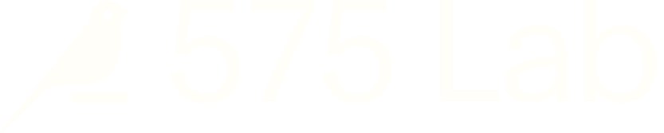

**Advancing Responsible AI through open source** &mdash; production-ready tools that give enterprises **transparency, control, and governance** to deploy AI with confidence.

Our Responsible AI work:
- **Trust** &mdash; no black boxes, no hidden behaviour
- **Control** &mdash; no vendor lock-in, no opaque dependencies
- **Accountability** &mdash; auditable, reproducible, community-reviewed

</div>

<div>

### Signature projects

- **Kiji Inspector** &mdash; mechanistic interpretability for agent tool selection *(this talk)*
- **Kiji Privacy Proxy** &mdash; detect &amp; redact sensitive data before LLM API calls

### Also contributing to

vLLM &middot; scikit-learn (sponsor) &middot; Cardinal (active learning) &middot; CodeMirror

[dataiku.com/open-source](https://www.dataiku.com/open-source)

</div>

</div>

---

## The Problem: Opaque Agent Decisions

AI agents autonomously select tools (databases, web search, code execution, ...) based on natural language requests.
But **why**?

> "Find information about *our company's* API rate limits."
> &rarr; Internal docs search? Or public web search?

Current approaches **fail** to provide mechanistic insight:

1. **Prompt engineering** -- reveals correlations, not causal mechanisms
2. **Behavioral testing** -- characterizes inputs/outputs, not internals
3. **Chain-of-thought** -- plausible narratives $\neq$ true computation

<div class="highlight">

We need to look **inside the model**.

</div>

---

<!-- _class: section -->

<div class="logo"></div>

### Part I

# The Solution

### Looking Inside with Sparse Autoencoders

---

## How to Understand Models &mdash; Step 1

### Autoencoders

A **self-supervised** technique that learns new representations: compress an input through a bottleneck, then reconstruct it. What survives the bottleneck is what the model considers essential.

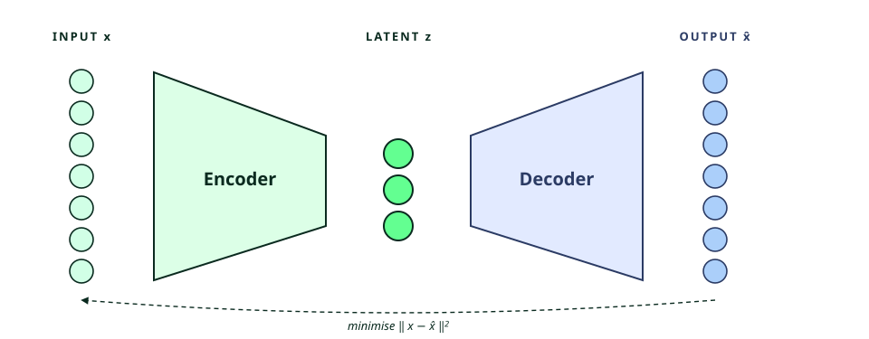

- **No labels required** -- the input *is* the target
- **Well-understood** -- decades of theory and practice
- **Lossy by design** -- the bottleneck forces the model to *prioritise*

---

## How to Understand Models &mdash; Step 2

### Sparse Autoencoders (SAE)

Flip the autoencoder on its head: instead of compressing, **expand** the latent space &mdash; but force fewer than **5%** of dimensions to fire on any given input.

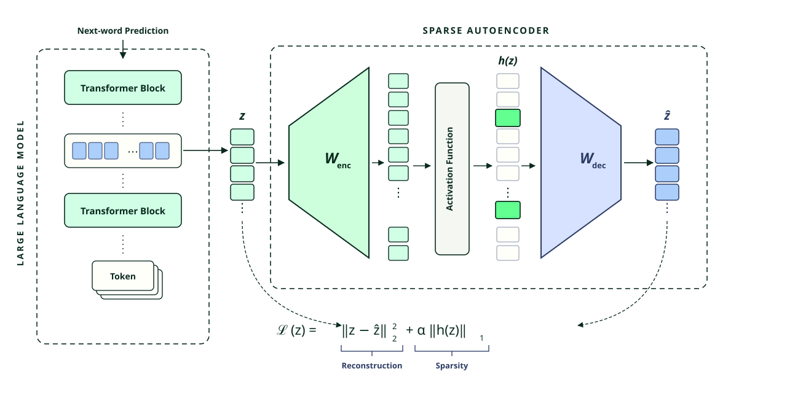

<!--- **Overcomplete dictionary** -- latent space is *wider* than the input-->
<!--- **Monosemantic features** -- each dimension tends to track one human-interpretable concept-->
<!--- **Sparsity constraint** -- $L_0 < 5\%$ of features active per token-->

---

## How to Understand Models &mdash; Step 3

### Interpreting What the Features Mean

A trained feature is just an index. To *label* it, collect the contexts where it fires most strongly &mdash; then let an LLM describe the pattern.

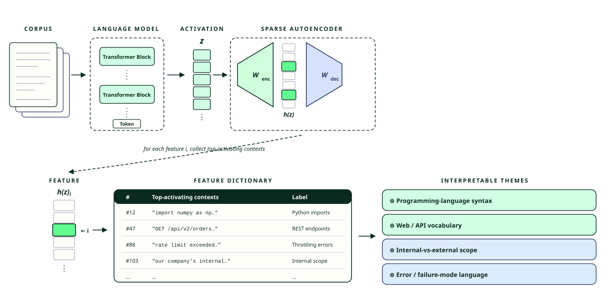

- **Feature &rArr; contexts** -- gather the top-*k* token spans that maximally activate each feature
- **Auto-interpretation** -- an LLM proposes a short natural-language label from those examples
- **Themes emerge** -- many features cluster around tool-relevant concepts (syntax, scope, error language)

---

## The Kiji Inspector

<div class="cols">

<div class="card">

<span class="badge">01</span>

### Model Agnostic

Framework to train custom Sparse Autoencoders &mdash; works on **any open-source LLM**, not just the ones we tested.

</div>

<div class="card">

<span class="badge">02</span>

### End-to-end Training Pipeline

No custom training setup needed. The project **generates the contrastive datasets** for you and runs the full extract &rarr; train &rarr; analyse loop.

</div>

</div>

<div class="cols">

<div class="card">

<span class="badge">03</span>

### Production Inference Support

vLLM patches, single-endpoint Docker containers, and PyPI packages &mdash; ready to drop into a live serving stack.

</div>

<div class="card">

<span class="badge">04</span>

### Fully Open Source

Pre-trained SAE models distributed via **Hugging Face**, **Docker Hub**, and **PyPI** &mdash; reuse without retraining.

</div>

</div>

GitHub: [github.com/dataiku/kiji-inspector](https://github.com/dataiku/kiji-inspector)

---

## What's Novel?

<div class="cols">

<div class="card">

<span class="badge">01</span>

### Decision-Token Extraction

Capture activations at the *precise moment* of tool commitment &mdash; not averaged over the prompt.

</div>

<div class="card">

<span class="badge">02</span>

### Contrastive Pairs as Post-hoc Probes

The SAE learns the model's natural vocabulary **unsupervised**. Contrastive pairs are statistical probes only &mdash; never training signal.

</div>

</div>

<div class="cols">

<div class="card">

<span class="badge">03</span>

### Token-Level Fuzzing Evaluation

Adapted from Eleuther AI's autointerp &mdash; catches labels that are *"right for the wrong reasons."*

</div>

<div class="card">

<span class="badge">04</span>

### Causal Validation via Ablation

Zero a feature, measure the prediction flip &mdash; turns correlations into evidence.

</div>

</div>

---

## Our Complete Training Pipeline

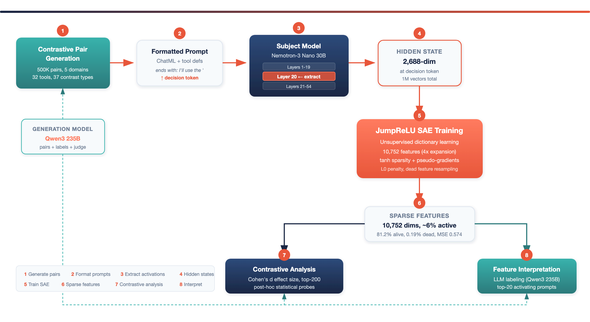

Contrastive pairs are generated and encoded by the subject model. The SAE is trained unsupervised on the extracted activations; contrastive pairs serve only as post-hoc statistical probes.

---

## Our Inference Setup

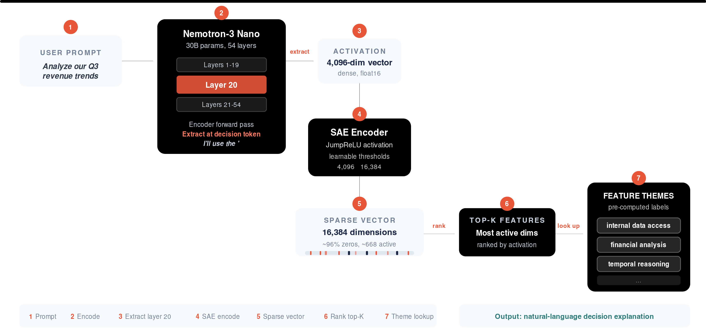

Seven steps from raw prompts to human-readable decision explanations.

---

## Nemotron-3 Nano Architecture

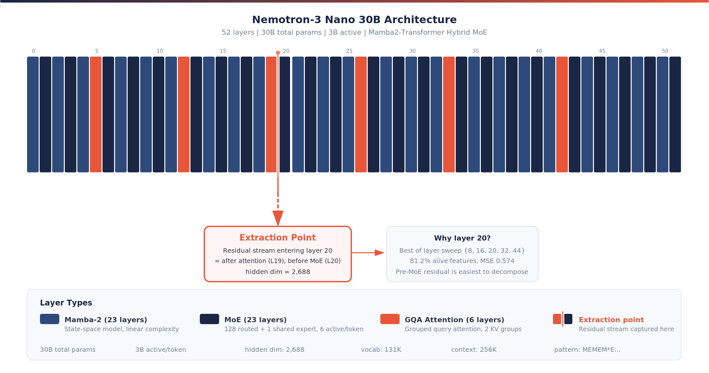

Hybrid Mamba2-Transformer MoE, 52 layers, open weights &mdash; chosen for routing diversity (MoE) and a tractable extraction budget at 30B. We extract activations at **layer 20** (GQA attention), the last dense layer before the next MoE block. *(Layer choice motivated two slides ahead.)*

---

## PyTorch SAE Model Architecture

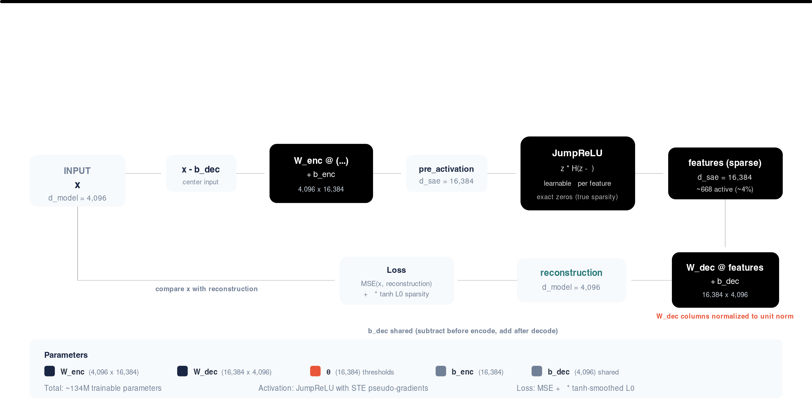

Encoder projects 4,096-dim input to 16,384 sparse features via JumpReLU with learnable per-feature thresholds. Decoder reconstructs with unit-norm columns. Shared bias b_dec centers the input.

---

## Decision Token Extraction

Every formatted prompt ends with:
```
<|assistant|> I'll use the '
```

The hidden state at this final token is the **decision token** -- the model's internal state at the moment it commits to a tool name.

- Activations extracted at **layer 20** of Nemotron-3-Nano-30B (54-layer MoE) &mdash; *layer choice justified below*
- Hidden dimension: **4,096**
- Batched extraction with left-padding for alignment
- Dataset: **1,000,000** activation vectors (500K contrastive pairs)

---

## Contrastive Pair Design

Pairs share the same *intent* but require *different tools*:

| Shared Intent | Anchor (tool A) | Contrast (tool B) |
|---|---|---|
| Resolve password issue | "How do I reset my password?" &rarr; `knowledge_base` | "I tried resetting 3 times but the email never arrives" &rarr; `ticket_lookup` |
| Evaluate energy stocks | "Which companies invest in renewables?" &rarr; `financial_analysis` | "Which stocks trade below book value?" &rarr; `market_data_lookup` |
| Check product version | "What is the latest version?" &rarr; `file_read` | "Set the version to v3.2.1" &rarr; `file_write` |

5 domains, 32 tools, 37 contrast types.

---

## JumpReLU SAE Architecture

*JumpReLU = ReLU with a learnable per-feature threshold &mdash; gives exact zeros but stays trainable via tanh pseudo-gradients (Rajamanoharan et al., 2024).*

**Encoder:**
$$f_i(\mathbf{x}) = \pi_i(\mathbf{x}) \cdot H(\pi_i(\mathbf{x}) - \theta_i)$$

where $\pi_i(\mathbf{x}) = [W_{\text{enc}}(\mathbf{x} - \mathbf{b}_{\text{dec}}) + \mathbf{b}_{\text{enc}}]_i$ and $\theta_i$ is a learnable threshold.

**Key properties:**
- **Exact sparsity** -- Heaviside step function $H$ produces true zeros
- **Smooth training** -- tanh approximation for gradient flow:
$$\hat{\mathcal{L}}_{\text{sparse}} = \sum_{i=1}^{M} \text{ReLU}\!\left(\tanh\!\left(\frac{\pi_i - \theta_i}{\varepsilon}\right)\right)$$
- **Pseudo-gradients** via rectangular kernel density estimator

Dictionary size $M = 16{,}384$ ($4 \times$ hidden dim).

---

## Why Layer 20?

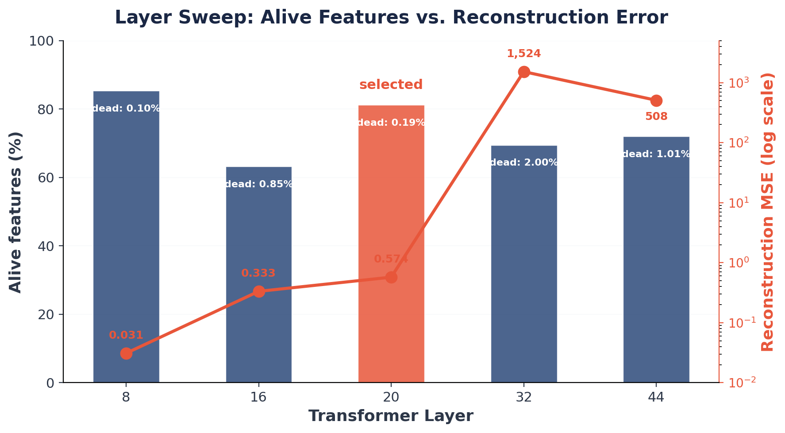

- Layers 8/16: low MSE but *pre-decision* representations
- **Layer 20**: best alive %, lowest dead %, MSE < 1.0
- Layers 32+: MoE expert routing &rarr; 500x+ higher MSE

---

## SAE Feature Health (Layer 20, Full Dataset)

| Metric | Value |
|--------|-------|
| Total features | 16,384 |
| Alive features (>0.1% firing) | **81.2%** [80.6, 81.8] |
| Dead features (0% firing) | **0.19%** [0.13, 0.27] |
| L0 (active features per input) | 668 (&asymp;4.1% density) |
| Reconstruction MSE | 0.574 |

The SAE efficiently uses its capacity: sparse encoding with high feature utilization.

---

## Baselines: Why Not Just a Probe?

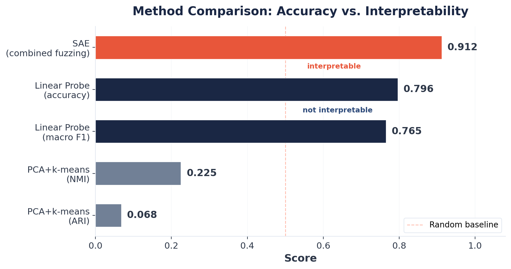

- Linear probe confirms tool identity is *linearly encoded* (79.6% across 32 classes) -- but provides *no interpretability*
- PCA + k-means fails entirely -- tool signal is not dominant variance
- The SAE bridges this gap: **interpretable** *and* **causally testable** features

---

## Token-Level Fuzzing Evaluation

*Autointerp (EleutherAI) is the standard recipe for labelling SAE features at scale: an LLM proposes a label from top-activating contexts, a second LLM judges whether the label predicts activation. We tighten the test.*

Standard evaluation: "Does this label predict which *prompts* activate the feature?"
Our evaluation: "Does this label predict which *tokens* activate the feature?"

**Protocol:**
1. Extract per-token activations across entire prompt
2. Highlight top-K tokens in user request span
3. A/B test: LLM judge picks which highlighted text matches the label
4. Randomized order to prevent position bias

**Combined score** = $0.7 \cdot \text{acc}_{\text{token}} + 0.3 \cdot \text{acc}_{\text{prompt}}$

Token-level gets higher weight because it tests the *actual mechanism*.

---

## Fuzzing Results: Features Are Interpretable

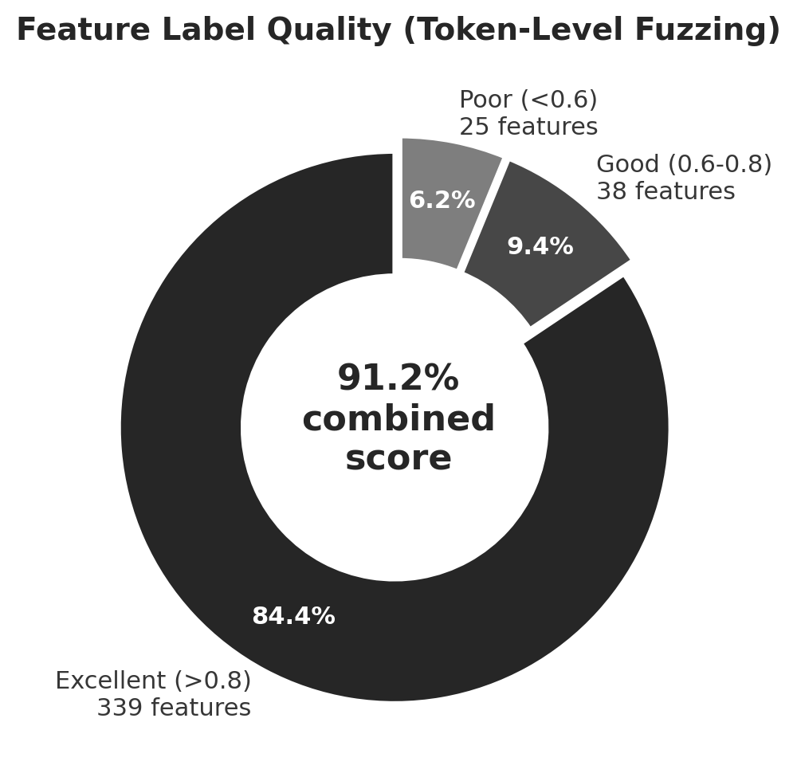

- **402 features**, combined score **0.912 &plusmn; 0.008** (p < 10^-4)
- Token-level accuracy: **0.906 &plusmn; 0.007**
- Emergent features without supervision: "internal knowledge retrieval",
  "data modification intent", "query complexity"

---

<!-- _class: section -->

<div class="logo"></div>

### Part II

# The Causality Test

From Correlation to Causal Evidence

---

## Feature Ablation: Experimental Design

**Question:** Are contrastive features *causally necessary* for tool selection, or merely correlated?

**Method:**
1. Intercept residual stream at layer 20
2. Encode through trained SAE
3. **Zero out top-10 contrastive features**
4. Decode back into residual stream
5. Measure: does the model's tool prediction *flip*?

**Controls:**
- **Random ablation**: zero 10 random non-contrastive features
- **Reconstruction-only**: SAE encode &rarr; decode with *no* features zeroed (measures round-trip distortion)

---

## Ablation Results: Causal Evidence

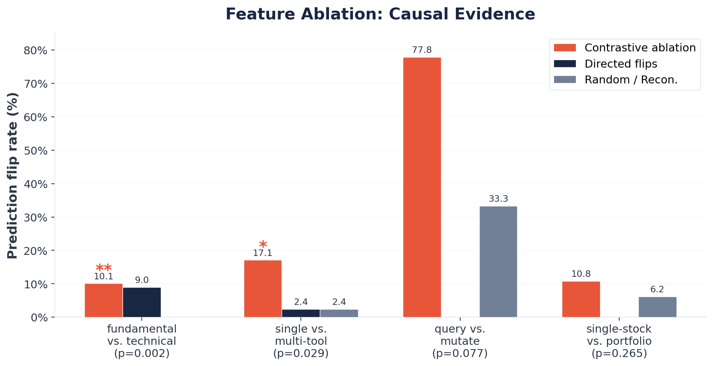

**Aggregate (23 types):** 16.1% contrastive vs. 13.0% reconstruction-only

---

## Why This Matters: Interpreting the Ablation

**Fundamental vs. Technical Analysis** (p = 0.002):
- Zeroing 10 contrastive features flips **10.1%** of predictions
- 9.0% flip *toward the contrast tool* (directed change)
- Random ablation: **0%** flips. Reconstruction-only: **0%** flips
- These features are *causally necessary* for this distinction

**Critical control insight:**
> Random ablation flip rate *equals* SAE round-trip distortion across all 23 contrast types. Removing 10 random features from ~668 active adds *no disruption beyond the encode-decode cycle itself*.

This validates the design: ablation effects are due to *specific features*, not general signal degradation.

---

## The Spectrum of Causal Involvement

Not all decisions rely on sparse feature circuits. Across 23 contrast types we see a spectrum:

- **Sparse circuits** -- a small minority (e.g. fundamental/technical, single/multi-tool) concentrate causal signal in a handful of identifiable features; ablating 10 contrastive features flips up to 10.1% of predictions
- **Distributed encodings** -- many contrast types (e.g. preventive/reactive maintenance) show 0% flips even with 10 features ablated, robust to any 10-feature subset
- **Intermediate** -- the remainder show detectable but not statistically dominant feature involvement

This reveals a heterogeneous landscape:
> Some tool-selection decisions are governed by interpretable sparse circuits; others rely on distributed, redundant encodings.

Both findings are scientifically valuable.

---

<!-- _class: section -->

<div class="logo"></div>

# Demo Time

### Kiji Inspector, live

---

## End-to-End Demo Application

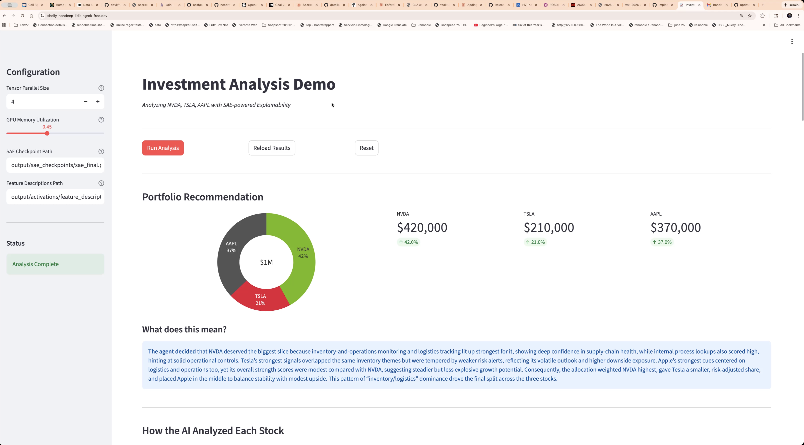

Interactive system surfacing SAE-derived explanations alongside agent output -- translating internal feature activations into natural-language rationales.

---

## Key Takeaways

1. **SAEs discover interpretable decision features** without supervision -- 91.2% fuzzing accuracy

2. **Token-level fuzzing** catches labels "right for the wrong reasons" -- a stricter test than prompt-level evaluation

3. **Causal evidence** via ablation: specific features are necessary for specific tool-selection decisions (p = 0.002)

4. **The reconstruction-only baseline** is essential -- it separates genuine causal effects from SAE distortion artifacts

5. **Heterogeneous decision landscape** -- some decisions use sparse circuits, others are distributed

---

## Limitations and Future Directions

<div class="cols">
<div>

### Current Limitations

- Training is compute-intensive (235B generation model + 30B subject model)
- Access to model is required 
- Synthetic contrastive pairs may miss real-world decision factors

</div>
<div>

### Future Work

- Support for more open-source models like Qwen 
- Multi-layer / circuit-level analysis
- Cross-model transfer (do tool-selection circuits generalize?)

</div>
</div>

---

<!-- _class: closing -->

<div class="logo"></div>

# Thank You

## Open source: github.com/dataiku/kiji-inspector


<p>Hannes Hapke — hannes.hapke@dataiku.com<br>David Cardozo — david.cardozo@dataiku.com<br>575 Lab, Dataiku Inc.</p>
